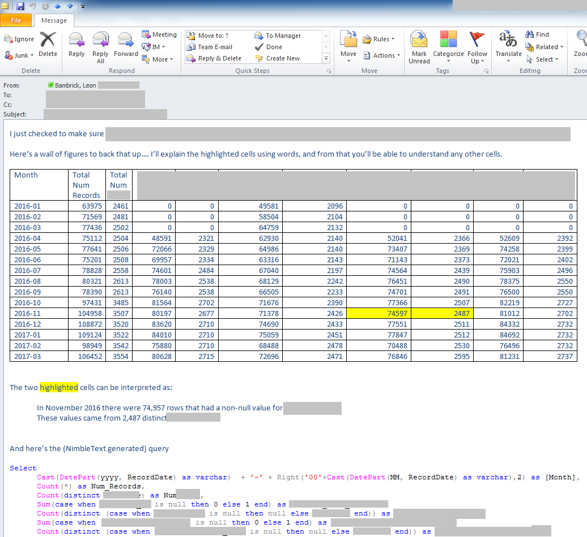

# Art of the data email

I often find that I need to send emails to people that include a table of data, based on an adhoc query.

Here's some principles that I use for these data emails.

1. Tailor the writing to the recipient. 

2. Always include the query at the foot of the email. It may not be useful to the person you sent it to, but it will be useful to yourself when you have to tweak your work later.

3. Use Outlook's table features to format the data appropriately. Simple styles are best. Right align numbers. (Consider center aligning header cells). Highlight and explain any portions that need to be explained.

Sometimes you need to send a wall of figures which you believe the recipient will benefit from if only they can get their head around what the wall of figures represent.

One technique I've tried for this is highlighting one or two figures from the table (or an entire row) and explaining it in words. Then it's up to the reader to generalise that understanding.

For example:

An alternative is to include a second table that is just a list of each column heading, with a description of what it means. 

Charts are another useful way to make a wall of figures immediately tell a story. Knowing when to use a line chart, a bar chart and when to use a pie chart (i.e. sparingly!) is important knowledge.

