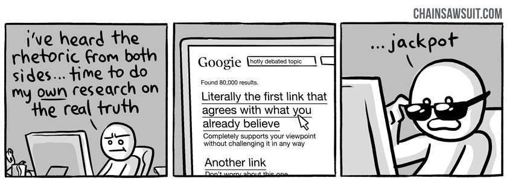

# Echo chamber

The greatest exposition of the echo chamber problem comes from this comic:

<http://chainsawsuit.com/comic/2014/09/16/on-research/>

You can get an insight into the problem we face today where people live in their own 'ideological bubbles' by visiting 
[Red feed blue feed at Wall street Journal](http://graphics.wsj.com/blue-feed-red-feed/)

An excellent article that can reveal your own ingroup-outgroup bias is available from [I can tolerate anything except the out group](http://slatestarcodex.com/2014/09/30/i-can-tolerate-anything-except-the-outgroup/)

Another example of an echo-chamber effect is what was known as the Steve Jobs Reality Distortion Field:

>Reality distortion field (RDF) is a term coined by Bud Tribble at Apple Computer in 1981, to describe company co-founder Steve Jobs's charisma and its effects on the developers working on the Macintosh project.

The common criticism of academia as existing within 'Ivory Towers' is about Echo chambers/Ideological bubbles.

Your echo-chamber, your ideological bubble, your personal RDF -- are all related to your [World View](https://en.wikipedia.org/wiki/World_view). The term 'World View' has been brought into English from the German philosophical concept: Weltanschauung.

## External references:

* [wikipedia: confirmation bias](https://en.wikipedia.org/wiki/Confirmation_bias)
* [Reflections on trusting trust](https://www.schneier.com/blog/archives/2006/01/countering_trus.html)
