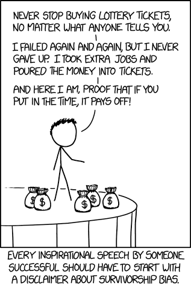

# Survivorship Bias.

>"Just because nobody complains doesn't mean all parachutes are perfect."
> &mdash;Benny Hill

An example of a selection bias.

You don't get the opportunity to gather evidence from the "non-survivors". Hence the evidence you do see is wildly tainted.

e.g

"The advice business is a monopoly run by survivors. When something becomes a non-survivor, it is either completely eliminated, or whatever voice it has is muted to zero."

We discount the role of luck (particularly when telling our own stories).

If enough scientists study a phenomenon, some will find statistically significant results by chance, and these are the experiments submitted for publication. Additionally, papers showing positive results may be more appealing to editors.

### Another example of a selection bias

When scientists began finding exo-planets (planets that orbit a star other than the sun) the first exo planets they found were massive. These were the only exo-planets that their methods were capable of detecting.

Journalists dutifully reported that most planets in the universe are gigantic, many times larger than Jupiter, and Earth is some kind of freakishly small anomaly, unique in a universe of gas giants. Thanks, Journalists!

## Related concept

> Privilege is invisible to those who have it. 
> &mdash;American sociologist, Prof Michael Kimmel

> "It is difficult to get a man to understand something, when his salary depends on his not understanding it." 
> &mdash;Upton Sinclair

## See Also

 * Darius Kazemi ["How I made it"](https://www.youtube.com/watch?v=l_F9jxsfGCw)  explains his technique for picking winning lottery numbers. (A satirical example of Survivorship Bias) 
 * [XKCD: Survivorship Bias](https://www.xkcd.com/1827/) and [Explain XKCD: Survivorship Bias](https://www.explainxkcd.com/wiki/index.php/1827:_Survivorship_Bias)  

 