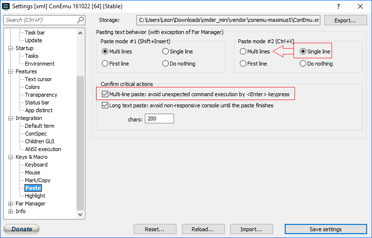
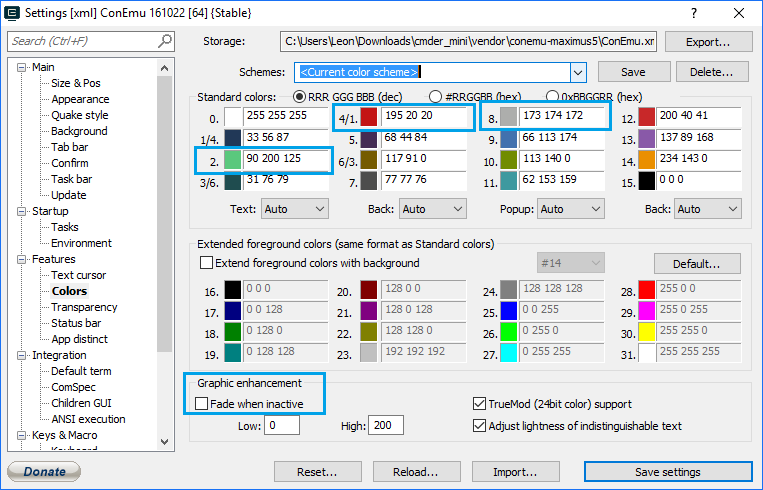
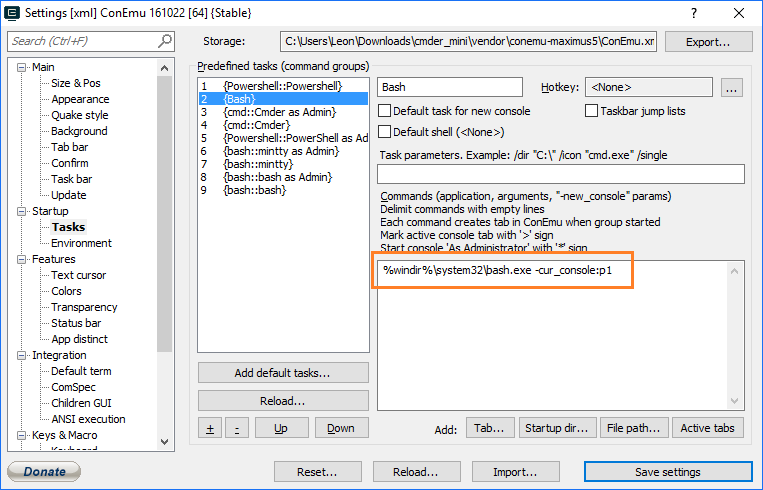

# Cmder 

Cmder relies on Conemu to create a beautiful console experience on windows. 

What matters the most: How do you insert?

Paste with `Shift Insert` -- which on a macbook air is "`fn shift enter`"

Can also use `Ctrl V` or Right Click, though they give slightly different behavior....

## Using Powershell with Cmder...

Set cmder to load powershell by default, via:

Settings -> Startup -> Tasks

Find the `{Powershell::Powershell}` task and move it Up Up Up to the top.

Change the task parameters:

    PowerShell -ExecutionPolicy Bypass -NoLogo -NoExit -new_console:d:"C:\users\leon\dropbox\secretgeek"

...instead of the default task parameters which swap in a different `profile.ps1` file, etc.

Then, in:

Settings -> Startup

Put the startup options as

"Specified Named task" --> {Powershell::Powershell}

## Color schemes

Their favorite color scheme is the muted tones of the "Monokai" color scheme.

If you want a fully light colored scheme -- keeps people awake in talks -- try "Tomorrow"

I did mess with it a little to get the colors how I wanted them in some circumstances.

## Arrow keys when running bash.exe (windows subsystem for linux)

This is a known issue lodged with ConEmu...

    https://github.com/Maximus5/ConEmu/issues/811

And traced back to a fault in the design of bash.exe

    https://github.com/Microsoft/BashOnWindows/issues/111

To fix it, I added a "`{Bash}`" task (in Settings -> Startup -> Tasks) with Command equal to:

    %windir%\system32\bash.exe -cur_console:p1   

    
    
I also added a `bash` function to my powershell `profile.ps1` which reads:

    function bash() {
        & $env:windir"\system32\bash.exe" -cur_console:p1
    }
    

## Fade when inactive

Change this in settings -> Features -> Color -> Graphic enhancement -> Fade when inactive.

(Included in one of the screenshots above)

    
## Source

 * <http://superuser.com/questions/652155/configure-powershell-to-be-conemus-default-shell>
 