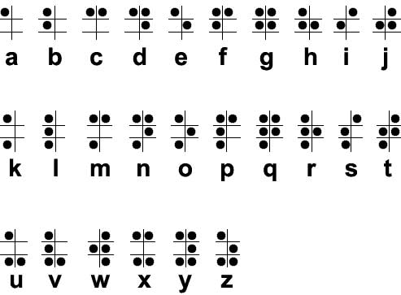
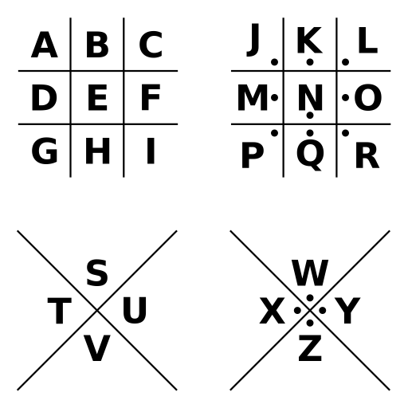

# Codes

Useful for field agents who need to crack codes they encounter.

* A=1 alphabet
* A=B and Rot-13 alphabet
* Morse Code Alphabet
* Braille Alphabet
* Pigpen Cipher
* Knights Templar Cipher
* Mayan Numbers
* All the Caesar Codes
* Decimal Ascii Letters
* Binary Numbers
* Binary Ascii Letters
* Hexadecimal Letters
* Leet Speak
* Wingdings

## A=1 alphabet

## A=B alphabet

## Morse Code Alphabet

## Braille Alphabet

## Pigpen Cipher

## ROT-13 Code

## All the Caesar Codes

| 0 | 1 | 2 | 3 | 4 | 5 | 6 | 7 | 8 | 9 | 10 | 11 | 12 | 13 | 14 | 15 | 16 | 17 | 18 | 19 | 20 | 21 | 22 | 23 | 24 | 25 |
|----|----|----|----|----|----|----|----|----|----|----|----|----|----|----|----|----|----|----|----|----|----|----|----|----|----|
| a | b | c | d | e | f | g | h | i | j | k | l | m | n | o | p | q | r | s | t | u | v | w | x | y | z |
| b | c | d | e | f | g | h | i | j | k | l | m | n | o | p | q | r | s | t | u | v | w | x | y | z | a |
| c | d | e | f | g | h | i | j | k | l | m | n | o | p | q | r | s | t | u | v | w | x | y | z | a | b |
| d | e | f | g | h | i | j | k | l | m | n | o | p | q | r | s | t | u | v | w | x | y | z | a | b | c |
| e | f | g | h | i | j | k | l | m | n | o | p | q | r | s | t | u | v | w | x | y | z | a | b | c | d |
| f | g | h | i | j | k | l | m | n | o | p | q | r | s | t | u | v | w | x | y | z | a | b | c | d | e |
| g | h | i | j | k | l | m | n | o | p | q | r | s | t | u | v | w | x | y | z | a | b | c | d | e | f |
| h | i | j | k | l | m | n | o | p | q | r | s | t | u | v | w | x | y | z | a | b | c | d | e | f | g |
| i | j | k | l | m | n | o | p | q | r | s | t | u | v | w | x | y | z | a | b | c | d | e | f | g | h |
| j | k | l | m | n | o | p | q | r | s | t | u | v | w | x | y | z | a | b | c | d | e | f | g | h | i |
| k | l | m | n | o | p | q | r | s | t | u | v | w | x | y | z | a | b | c | d | e | f | g | h | i | j |
| l | m | n | o | p | q | r | s | t | u | v | w | x | y | z | a | b | c | d | e | f | g | h | i | j | k |
| m | n | o | p | q | r | s | t | u | v | w | x | y | z | a | b | c | d | e | f | g | h | i | j | k | l |
| n | o | p | q | r | s | t | u | v | w | x | y | z | a | b | c | d | e | f | g | h | i | j | k | l | m |
| o | p | q | r | s | t | u | v | w | x | y | z | a | b | c | d | e | f | g | h | i | j | k | l | m | n |
| p | q | r | s | t | u | v | w | x | y | z | a | b | c | d | e | f | g | h | i | j | k | l | m | n | o |
| q | r | s | t | u | v | w | x | y | z | a | b | c | d | e | f | g | h | i | j | k | l | m | n | o | p |
| r | s | t | u | v | w | x | y | z | a | b | c | d | e | f | g | h | i | j | k | l | m | n | o | p | q |
| s | t | u | v | w | x | y | z | a | b | c | d | e | f | g | h | i | j | k | l | m | n | o | p | q | r |
| t | u | v | w | x | y | z | a | b | c | d | e | f | g | h | i | j | k | l | m | n | o | p | q | r | s |
| u | v | w | x | y | z | a | b | c | d | e | f | g | h | i | j | k | l | m | n | o | p | q | r | s | t |
| v | w | x | y | z | a | b | c | d | e | f | g | h | i | j | k | l | m | n | o | p | q | r | s | t | u |
| w | x | y | z | a | b | c | d | e | f | g | h | i | j | k | l | m | n | o | p | q | r | s | t | u | v |
| x | y | z | a | b | c | d | e | f | g | h | i | j | k | l | m | n | o | p | q | r | s | t | u | v | w |
| y | z | a | b | c | d | e | f | g | h | i | j | k | l | m | n | o | p | q | r | s | t | u | v | w | x |
| z | a | b | c | d | e | f | g | h | i | j | k | l | m | n | o | p | q | r | s | t | u | v | w | x | y |

## Decimal Ascii Letters

## Binary Numbers

| Decimal | Binary|
|---------|-------|
| 0 | 000000 |
| 1 | 000001 |
| 2 | 000010 |
| 3 | 000011 |
| 4 | 000100 |
| 5 | 000101 |
| 6 | 000110 |
| 7 | 000111 |
| 8 | 001000 |
| 9 | 001001 |
| 10 | 001010 |
| 11 | 001011 |
| 12 | 001100 |
| 13 | 001101 |
| 14 | 001110 |
| 15 | 001111 |
| 16 | 010000 |
| 17 | 010001 |
| 18 | 010010 |
| 19 | 010011 |
| 20 | 010100 |
| 21 | 010101 |
| 22 | 010110 |
| 23 | 010111 |
| 24 | 011000 |
| 25 | 011001 |
| 26 | 011010 |
| 27 | 011011 |
| 28 | 011100 |
| 29 | 011101 |
| 30 | 011110 |
| 31 | 011111 |
| 32 | 100000 |

## Decimal Ascii Letters

| Num | Char | Num | Char |
|----|----|----|----|
| 65 | A | 97 | a |
| 66 | B | 98 | b |
| 67 | C | 99 | c |
| 68 | D | 100 | d |
| 69 | E | 101 | e |
| 70 | F | 102 | f |
| 71 | G | 103 | g |
| 72 | H | 104 | h |
| 73 | I | 105 | i |
| 74 | J | 106 | j |
| 75 | K | 107 | k |
| 76 | L | 108 | l |
| 77 | M | 109 | m |
| 78 | N | 110 | n |
| 79 | O | 111 | o |
| 80 | P | 112 | p |
| 81 | Q | 113 | q |
| 82 | R | 114 | r |
| 83 | S | 115 | s |
| 84 | T | 116 | t |
| 85 | U | 117 | u |
| 86 | V | 118 | v |
| 87 | W | 119 | w |
| 88 | X | 120 | x |
| 89 | Y | 121 | y |
| 90 | Z | 122 | z |

## Decimal, Hexadecimal, Binary and ASCII

| Decimal | Hexadecimal | Binary | Character |
|---------|-------------|--------|-----------|
| 0 | 00 | 00000000 | (Null character)  |
| 1 | 01 | 00000001 | (Start of Header)  |
| 2 | 02 | 00000010 | (Start of Text)  |
| 3 | 03 | 00000011 | (End of Text)  |
| 4 | 04 | 00000100 | (End of Trans)  |
| 5 | 05 | 00000101 | (Enquiry)  |
| 6 | 06 | 00000110 | (Acknowledgement)  |
| 7 | 07 | 00000111 | (Bell)  |
| 8 | 08 | 00001000 | (Backspace)  |
| 9 | 09 | 00001001 | (Horizontal Tab)  |
| 10 | 0A | 00001010 | (Line feed)  |
| 11 | 0B | 00001011 | (Vertical Tab)  |
| 12 | 0C | 00001100 | (Form feed)  |
| 13 | 0D | 00001101 | (Carriage return)  |
| 14 | 0E | 00001110 | (Shift Out)  |
| 15 | 0F | 00001111 | (Shift In)  |
| 16 | 10 | 00010000 | (Data link escape)  |
| 17 | 11 | 00010001 | (Device control 1)  |
| 18 | 12 | 00010010 | (Device control 2)  |
| 19 | 13 | 00010011 | (Device control 3)  |
| 20 | 14 | 00010100 | (Device control 4)  |
| 21 | 15 | 00010101 | (Negative acknowl)  |
| 22 | 16 | 00010110 | (Synchronous idle)  |
| 23 | 17 | 00010111 | (End of trans)  |
| 24 | 18 | 00011000 | (Cancel)  |
| 25 | 19 | 00011001 | (End of medium)  |
| 26 | 1A | 00011010 | (Substitute)  |
| 27 | 1B | 00011011 | (Escape)  |
| 28 | 1C | 00011100 | (File separator)  |
| 29 | 1D | 00011101 | (Group separator)  |
| 30 | 1E | 00011110 | (Record separator)  |
| 31 | 1F | 00011111 | (Unit separator)  |
| 32 | 20 | 00100000 | (space)  |
| 33 | 21 | 00100001 | !  |
| 34 | 22 | 00100010 | "  |
| 35 | 23 | 00100011 | #  |
| 36 | 24 | 00100100 | $  |
| 37 | 25 | 00100101 | %  |
| 38 | 26 | 00100110 | &  |
| 39 | 27 | 00100111 | '  |
| 40 | 28 | 00101000 | (  |
| 41 | 29 | 00101001 | )  |
| 42 | 2A | 00101010 | *  |
| 43 | 2B | 00101011 | +  |
| 44 | 2C | 00101100 | ,  |
| 45 | 2D | 00101101 | -  |
| 46 | 2E | 00101110 | .  |
| 47 | 2F | 00101111 | /  |
| 48 | 30 | 00110000 | 0  |
| 49 | 31 | 00110001 | 1  |
| 50 | 32 | 00110010 | 2  |
| 51 | 33 | 00110011 | 3  |
| 52 | 34 | 00110100 | 4  |
| 53 | 35 | 00110101 | 5  |
| 54 | 36 | 00110110 | 6  |
| 55 | 37 | 00110111 | 7  |
| 56 | 38 | 00111000 | 8  |
| 57 | 39 | 00111001 | 9  |
| 58 | 3A | 00111010 | :  |
| 59 | 3B | 00111011 | ;  |
| 60 | 3C | 00111100 | <  |
| 61 | 3D | 00111101 | =  |
| 62 | 3E | 00111110 | >  |
| 63 | 3F | 00111111 | ?  |
| 64 | 40 | 01000000 | @  |
| 65 | 41 | 01000001 | A  |
| 66 | 42 | 01000010 | B  |
| 67 | 43 | 01000011 | C  |
| 68 | 44 | 01000100 | D  |
| 69 | 45 | 01000101 | E  |
| 70 | 46 | 01000110 | F  |
| 71 | 47 | 01000111 | G  |
| 72 | 48 | 01001000 | H  |
| 73 | 49 | 01001001 | I  |
| 74 | 4A | 01001010 | J  |
| 75 | 4B | 01001011 | K  |
| 76 | 4C | 01001100 | L  |
| 77 | 4D | 01001101 | M  |
| 78 | 4E | 01001110 | N  |
| 79 | 4F | 01001111 | O  |
| 80 | 50 | 01010000 | P  |
| 81 | 51 | 01010001 | Q  |
| 82 | 52 | 01010010 | R  |
| 83 | 53 | 01010011 | S  |
| 84 | 54 | 01010100 | T  |
| 85 | 55 | 01010101 | U  |
| 86 | 56 | 01010110 | V  |
| 87 | 57 | 01010111 | W  |
| 88 | 58 | 01011000 | X  |
| 89 | 59 | 01011001 | Y  |
| 90 | 5A | 01011010 | Z  |
| 91 | 5B | 01011011 | [  |
| 92 | 5C | 01011100 | \  |
| 93 | 5D | 01011101 | ]  |
| 94 | 5E | 01011110 | ^  |
| 95 | 5F | 01011111 | _  |
| 96 | 60 | 01100000 | `  |
| 97 | 61 | 01100001 | a  |
| 98 | 62 | 01100010 | b  |
| 99 | 63 | 01100011 | c  |
| 100 | 64 | 01100100 | d  |
| 101 | 65 | 01100101 | e  |
| 102 | 66 | 01100110 | f  |
| 103 | 67 | 01100111 | g  |
| 104 | 68 | 01101000 | h  |
| 105 | 69 | 01101001 | i  |
| 106 | 6A | 01101010 | j  |
| 107 | 6B | 01101011 | k  |
| 108 | 6C | 01101100 | l  |
| 109 | 6D | 01101101 | m  |
| 110 | 6E | 01101110 | n  |
| 111 | 6F | 01101111 | o  |
| 112 | 70 | 01110000 | p  |
| 113 | 71 | 01110001 | q  |
| 114 | 72 | 01110010 | r  |
| 115 | 73 | 01110011 | s  |
| 116 | 74 | 01110100 | t  |
| 117 | 75 | 01110101 | u  |
| 118 | 76 | 01110110 | v  |
| 119 | 77 | 01110111 | w  |
| 120 | 78 | 01111000 | x  |
| 121 | 79 | 01111001 | y  |
| 122 | 7A | 01111010 | z  |
| 123 | 7B | 01111011 | {  |
| 124 | 7C | 01111100 | (pipe)  |
| 125 | 7D | 01111101 | }  |
| 126 | 7E | 01111110 | ~  |
| 127 | 7F | 01111111 | (Delete character)  |

