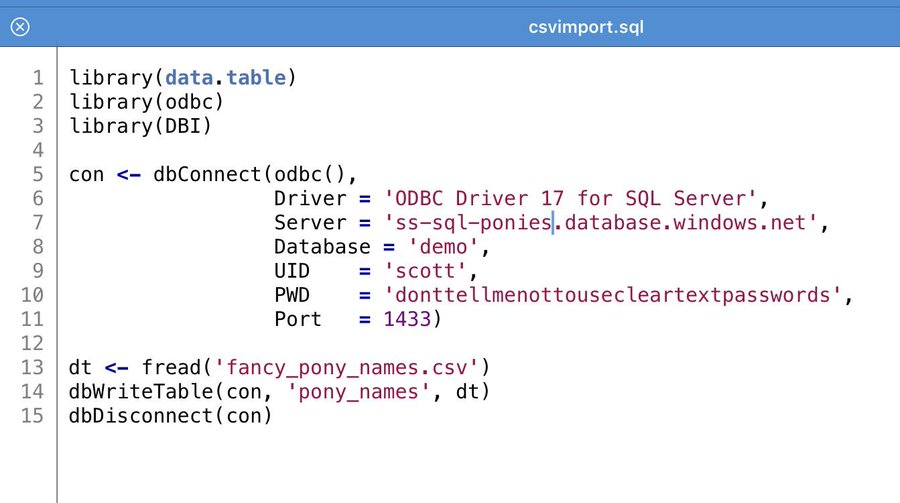

# Import CSV file to a Database, quickly

> Challenge: you have a csv file and you need to import it into a new table in a database. You have 5 mins to get it done. What tools do you use?
>
> [@secretgeek](https://twitter.com/secretGeek/status/1179515031190306817)

Below are many different solutions to this common problem, for a variety of databases and operating systems.

## Any database with any OS

- Python with Pandas

		import pandas
		from sqlalchemy import create_engine
		engine = create_engine('connection string')
		df = pandas.read_csv("path/to.csv")
		df.to_sql("table_name", engine)
- "R"

	Via [Scott Stanfield:](https://twitter.com/seesharp/status/1179569651119874048?s=20)

	> Load in R with data.table fread() method. It'll impute the data types...gets you 80% of the way there. 
	
* [csv2db](https://github.com/csv2db/csv2db) &mdash; "The CSV command line loader."
- [Generate SQL Insert Statements with NimbleText (web version)](https://nimbletext.com/HowTo/GenerateInsert)
- [Datagrip: import/export](https://www.jetbrains.com/datagrip/features/importexport.html) &mdash; "There is a dedicated UI for importing DSV (CSV and TSV) files to the database."

#### Some brute force approaches (common!)
- Sublime (editor), use Multiple line edit to turn the data into SQL
- (Any editor), use search/replace (perhaps with regular expressions) to turn the data into SQL
- (Any spreadsheet), write formulae that combine the data together to turn the data into SQL

## Any database with Windows tools

 - [LinqPad](https://www.linqpad.net/) &mdash; [CSV to IEnumerable (or Array) in Linqpad](/linqpad/csv_to_array.md)
 - Microsoft Log Parser

        Logparser -o sql -server 127.0.0.1 -database -createtable on "select * into newtable from C:\Apps\Logs\Logfile.log" 

 - [Alteryx](https://www.alteryx.com) ($$$)
    - drag in an `Input data`, point it at the csv file.
    - (optional) drag in a `Select`, use it to configure the column types
    - drag in an `Output data`, point it at the database (and set the table name)
    - Run!
- [Generate SQL Insert Statements with NimbleText (downloaded version)](https://nimbletext.com/HowTo/GenerateInsert)
   
	> The desktop version lets you a "real" CSV parser that handles embedded delimiters/line breaks etc. Just switch on the `use qualifier` option under `tools` | `options`.

## Any Database with MacOS

(No examples available)

## MS SQL Server Specific

* Sql Server Management Studio (SSMS) &mdash; right click on Database, Tasks, "Import Flat File..."
* BCP (Bulk Copy Program)
* TSQL: [BULK INSERT](https://docs.microsoft.com/en-us/sql/relational-databases/import-export/import-bulk-data-by-using-bulk-insert-or-openrowset-bulk-sql-server?view=sql-server-2017)

		BULK INSERT Sales.Orders
		FROM '\\SystemX\DiskZ\Sales\data\orders.csv'
		WITH ( FIRSTROW = 2, FORMAT='CSV');

* Powershell: [Four Easy Ways to Import CSV Files to SQL Server with PowerShell](https://devblogs.microsoft.com/scripting/four-easy-ways-to-import-csv-files-to-sql-server-with-powershell/)

* [SQL Down under tools](https://sqldownunder.com/pages/sdu-tools) &mdash; see [ReadCSV demo movie](https://www.youtube.com/watch?v=ypuHanV2c6E&feature=youtu.be)

## SQLite specific

- [Tutorial: Import a CSV File Into an SQLite Table](https://www.sqlitetutorial.net/sqlite-import-csv/)

If there are no header names in the csv, then find the column names and run:

	create table mytable (header_a, header_b, header_c) 

Next step (do this whether you needed the previous step or not)

	.mode csv
	.import data.csv mytable

## MySQL specific

- [Load Data Infile](http://www.mysqltutorial.org/import-csv-file-mysql-table/)

		LOAD DATA INFILE 'c:/tmp/discounts.csv' 
		INTO TABLE discounts 
		FIELDS TERMINATED BY ',' 
		ENCLOSED BY '"'
		LINES TERMINATED BY '\n'
		IGNORE 1 ROWS;

- PhpMyAdmin

## Postgresql specific

Two techniques: `Copy` command in sql itself, and `\copy` command in `psql` (interactive commandline).

 - [Sql-copy](https://www.postgresql.org/docs/current/sql-copy.html) &mdash; requires root access

		COPY dog_habits FROM '/home/user521/pets/dog_habits.csv' DELIMITER ',' CSV HEADER;

 - [psql \copy](https://www.postgresql.org/docs/current/app-psql.html) &mdash; use interactive psql commandline where file permissions are an issue 

        psql -c "\copy sample FROM '/home/user521/pets/dog_habits.csv' WITH (FORMAT CSV)"

## Oracle specific

- [9 Simple Steps to Import CSV into Oracle Table Using Toad](https://www.foxinfotech.in/2018/07/9-simple-steps-to-import-csv-into-oracle-table-using-toad.html)

- [Oracle APEX](https://apex.oracle.com/en/)

   > "a couple of clicks and we're done"
   >
   > [@APEX/JeffreyKemp.sql](https://twitter.com/jeffreykemp/status/1179990364259663872)

## Hadoop specific

- [@BenBrandwood](https://twitter.com/ben_brandwood/status/1179689026930036736) gives this Hadoop example...

		hive> CREATE EXTERNAL TABLE IF NOT EXISTS test_ext
		> (ID int,
		> DEPT int,
		> NAME string
		> )
		> ROW FORMAT DELIMITED
		> FIELDS TERMINATED BY ','
		> STORED AS TEXTFILE
		> LOCATION '/test';
		OK
		Time taken: 0.395 seconds

## Alternative: Just treat the CSV as SQL

- [TextQL](http://dinedal.github.io/textql/) &mdash; Execute SQL against CSV or TSV.
- [q](https://harelba.github.io/q/) &mdash; Run SQL directly on CSV Files
- [RBQL](https://rbql.org) &mdash; Rainbow Query Language, a SQL-like language with JavaScript or Python backend.

