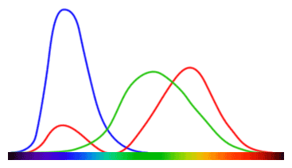

# Color Resources

Color is wild! 

You, a baby: just a bit of red, a bit of green and a bit of blue, stand back! I've got this!

Me, an intellectual: hold on a moment kiddo. There's a lot more to it. Perception is not uniform in that color space you're navigating. And different cultures perceive colors differently, our brain-maps are grown individually, in a context of their own, and it all makes a heck of a difference. Color is out of this world! Even if our brains were all aligned, the retina does a lot of work, with color cones of three different kinds, and sometimes less and sometimes more... 

And if you understood a single color (which I doubt you ever can)... these things are deployed in sets, called "palettes" and the way the palettes are combined, the theories thereof, can themselves fill if not a book certainly a pamphlett.

## Articles

* [How to Master Colour Theory](https://www.creativebloq.com/colour/colour-theory-11121290) Color Theory 101
* [Marketers Guide to Colour](https://themarketingindex.com/the-marketers-guide-to-psychology-of-colour/)
* [Color and psychological functioning: a review of theoretical and empirical work](https://www.ncbi.nlm.nih.gov/pmc/articles/PMC4383146/)
* How the retina works (including, why does violet look a little bit red??)
	* [The difference between violet and purple](https://jakubmarian.com/difference-between-violet-and-purple/)
* [Why Monet Never Used Black](https://designforhackers.com/blog/impressionist-color-theory/), notes:
	* Red/orange/yellow are "warm"
	* green/blue/purple are "cool"
	* Warm colors "pop", Cool Colors Recede
	* Tints pop, shades recede
	* Temperature is stronger than tint
	* Temperature can enrich your typography
	* Color relationships add life to graphics
* Why Rainbow is bad for data visualizations (and what to do about it)
	* One of my goals is to make the rainbow color map as rare in visualization as the goto statement is in programming.
	* [Rainbow Color Map (Still) Considered Harmful](https://ieeexplore.ieee.org/document/4118486)
	* [Poynter: Why rainbow colors aren’t the best option for data visualizations](https://www.poynter.org/archive/2013/why-rainbow-colors-arent-always-the-best-options-for-data-visualizations/)
	* [Turbo, An Improved Rainbow Colormap for Visualization](https://ai.googleblog.com/2019/08/turbo-improved-rainbow-colormap-for.html)

> &uarr; "A MacAdam diagram in the CIE 1931 color space. The ellipses are shown ten times their actual size."
>
> [from Wikipedia: Color Difference](https://en.wikipedia.org/wiki/Color_difference#Tolerance)

## Tools/techniques for making visual elements color-blind friendly

 * [3 Free Tools to Ensure Color Blind-Friendly Designs](https://medium.com/everyone-is-a-product-expert/3-free-tool-to-ensure-color-blind-friendly-designs-28d93cf238d)
 * [How to Design for Color Blindness](https://usabilla.com/blog/how-to-design-for-color-blindness/)

## Palette Tools

* Google for "Color picker" and you'll find google includes a proficient color picker tool, including conversion between hex/rgb/cmyk/hsv/hsl
* [Color Brewer](http://colorbrewer2.org/#type=sequential&scheme=BuGn&n=3) &mdash; for gradients to use on maps
* [Paletton](https://paletton.com/) &mdash; good for picking monochromatic, complementary, adjacent, triadic, tetradic and free-style palettes.
* [Adobe color wheel](https://color.adobe.com/create/color-wheel/) &mdash; previously "kuler", redesigned and improved
* [Duotone](https://duotone.shapefactory.co/) &mdash; Colorize a background
* [Dribbble](https://dribbble.com) &mdash; with dribbble you can search by color and can see the palette used in an image
* [Hue Test](https://www.colormunki.com/game/huetest_kiosk) &mdash; Drag and drop the colors in each row to arrange them by hue order.

## And finally

* [Wikipedia: List of Fictional Colors](https://en.wikipedia.org/wiki/List_of_fictional_colors) ... sure to make your designs Pop!