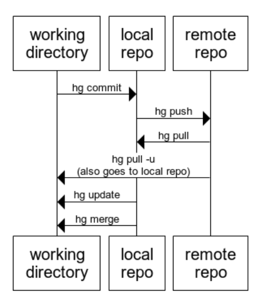
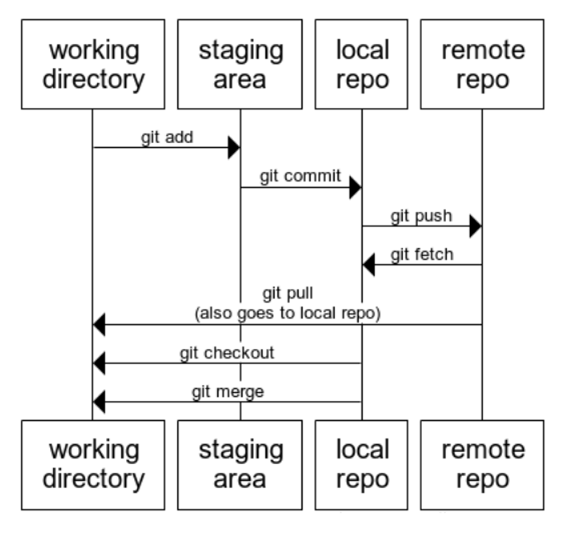

# git for mercurial users

## how mercurial does it...

## how git does it...

big difference is the "staging area" and fetch/pull.

|mercurial | git | note
|----|----|----|
| hg init | git init | |
| hg pull | git fetch | bring into local repo but not working folder |
| hg pull --update | git pull | bring into local repo *and* working folder |
| hg pull --rebase | git pull --rebase | |
| hg status | git status | |
| hg diff | git diff HEAD | shows all changes whether staged or not |
| hg outgoing | git log --branches --not --remotes=origin | (bit of a mouthful, can use an alias)|

See: <https://github.com/sympy/sympy/wiki/Git-hg-rosetta-stone#Rosetta_Stone>

## git config example

	[http]
		proxy = {your proxy if needed}
	[https]
		proxy = {your proxy if needed}
	[user]
		name = Leon 
		email = Leon@example.com
	[credential]
		helper = manager
	[alias]
		outgoing = log --branches --not --remotes=origin
		out = !git outgoing
		incoming = !git fetch ; git log ..origin/master
		in = !"git incoming"
		st = status
		stat = status
		paths = remote -v
		path = !"git paths"
		heads = show-ref
		alias = config --get-regexp alias
		

## set up your config

	git config --global user.name "Leon"
	git config --global user.email "Leon@example.com"
	git config --global http.proxy {your proxy if needed}
	git config --global https.proxy {your proxy if needed}

## See also

* [Phil Haack's aliases](http://haacked.com/archive/2014/07/28/github-flow-aliases/)
* [Rosetta stone](https://github.com/sympy/sympy/wiki/Git-hg-rosetta-stone#Rosetta_Stone)