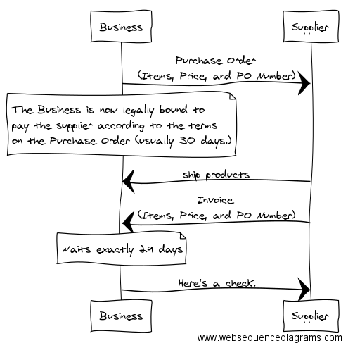

# Create sequence diagrams online

Example from [A Smart Bear: How to sell to large companies](https://blog.asmartbear.com/selling-to-large-companies.html)

[See link](http://www.websequencediagrams.com/?lz=QnVzaW5lc3MtPlN1cHBsaWVyOiBQdXJjaGFzZSBPcmRlclxuKEl0ZW1zLCBQcmljZSwgYW5kIFBPIE51bWJlcikKbm90ZSBvdmVyIABECApUaGUABAkgaXMgbm93IGxlZ2FsbHkgYm91bmQgdG8gCnBheSB0aGUgcwByByBhY2NvcmRpbmcgdG8AFQV0ZXJtcwpvbgAiBQCBCA4gKHVzdQBMBTMwIGRheXMuKQplbmQgbm90ZQoAgUMILT4AgVcIOiBzaGlwIHByb2R1Y3RzAA0VSW52b2ljZQCBPjI6IFdhaXRzIGV4YWN0bHkgMjkAgQ0FCgCCSBRIZXJlJ3MgYSBjaGVjay4KCg&s=napkin)

> That's nice, but check out the PlantUML extension to @code
> Similar syntax but supports more and no service dependency.

I've installed PlantUML. The docs for it are here:

https://marketplace.visualstudio.com/items?itemName=jebbs.plantuml

I created this file:

	@startuml
	Alice -> Bob: Authentication Request
	Bob --> Alice: Authentication Response

	Alice -> Bob: Another authentication Request
	Alice <-- Bob: another authentication Response
	@enduml

And then used Alt-D to preview the current file.
(This relied on having restarted VS Code after installing the PlantUML extension.

Looks like you can style the diagrams with a wsd file (which stands for 'websequencediagram':

	@startuml
		!include ../includes/defines.wsd
		!include ../includes/myStyles.wsd
		'contents goes here...
	@enduml
	Now, you can just replace them with a placehold 'autoinclude,

	@startuml
		'autoinclude
		'contents goes here...
	@enduml

More details about sequence-diagram syntax here: <http://plantuml.com/sequence-diagram>
	
	
## Source

 * [A Smart Bear: How to sell to large companies](https://blog.asmartbear.com/selling-to-large-companies.html)
