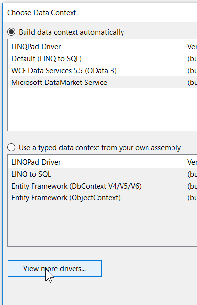
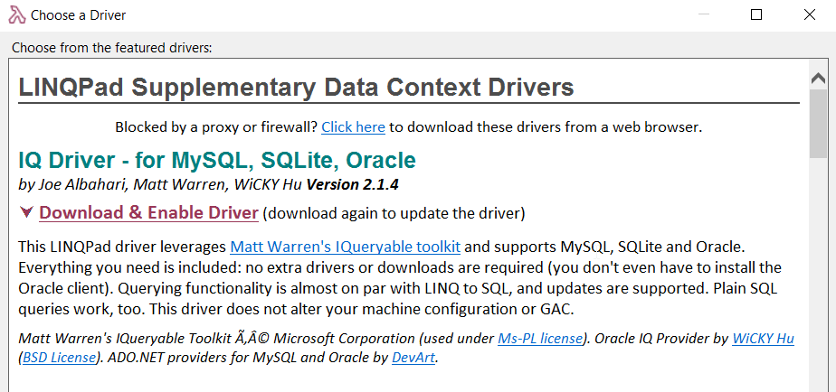
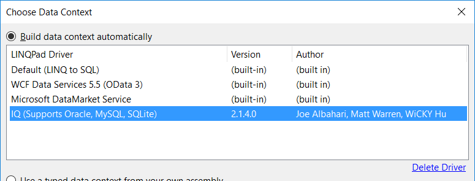
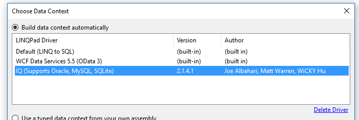

# Connect Linqpad to Oracle

...using an IQ Connection.

Step 1, `Add connection`

Step 2, click `view more drivers`

Step 3, Find "IQ Driver - for MySQL, SQLite, Oracle"

click "Download & Enable Driver"

Now when you choose "Add Connection" you'll forever see "IQ" listed.

Pick Next.

Choose `Direct (Oracle Client not Required)`

(it has these limitations: <http://www.devart.com/dotconnect/oracle/docs/DirectMode.html>

Now here are the tricks....

Given this connection string

	"Data Source=SRV1238xx1.example.com:1234/DS128x; User Id=UserUser; Password=PassPass;"
	

On the dialog, you would set:

	Server = SRV1238xx1.example.com
	User = UserUser
	password = PassPass

Give it a friendly name

Then on the 'Advanced' tab Set:

	Port = 1234

And in addition connection string options, type:

	Service Name=DS128x
	
**Note the space between Service and Name**

Optionallly, you can set a default schema, if you know a schema that you're most interested in. (It's not mentioned in the example connection string above. Setting one will allow you to browse the schema details: list of tables, views, columns, etc.)

Hit `test` to test. And Bob's your Uncle.

# Upgrading the "IQ Driver"

Although this worked perfectly well at first, one day the Oracle DBA's upgraded something on the servers and suddenly my linqpad queries returned this error:

> Connection Error: ORA-28040: No matching authentication protocol

The solution was to update my copy of the IQ Driver. To do this I had to remove it, and add it again.

To remove it:

Click "Add connection" as shown above, select the "IQ (Support Oracle, MySQL, SQLite)" data context, and click "Delete Driver"

	
Then add the driver back in, as explained above. i.e. click "View more drivers..." and select the one you're interested in.

It will now be upgraded, and your problem may be resolved.

Or it may not.

What do I know? I'm just some guy in the internet.	
