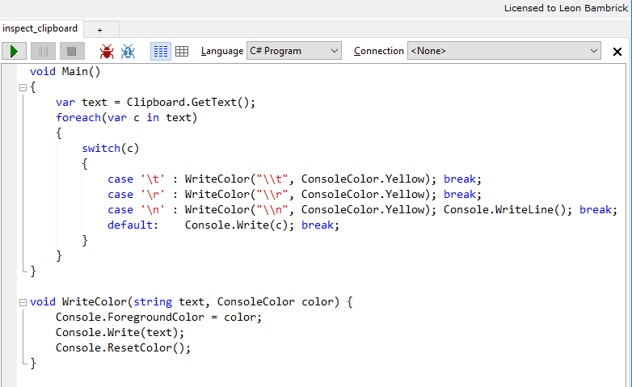
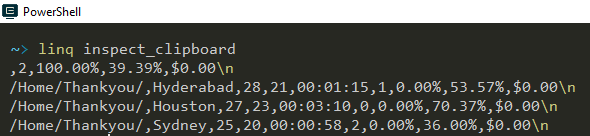

# Inspect clipboard with linqpad

While testing the upcoming [NimbleText](http://NimbleText.com) enhancements I need to be able to inspect the line endings on the clipboard, so I've put this LinqPad script into my [linqpad script folder](invoke_linqpad_commandlet.md)

And now, thanks to the magic of the `Invoke-LinqPadScript` commandlet, if I type `linq inspect_clipboard` I will instantly see, color coded, what special characters are on the clipboard:

Code (requires a reference to, and "Additional namespace import" of, `System.Windows.Forms` (hit F4)

    void Main()
    {
        var text = Clipboard.GetText();
        foreach(var c in text)
        {
            switch(c)
            {
                case '\t' : WriteColor("\\t", ConsoleColor.Yellow); break;
                case '\r' : WriteColor("\\r", ConsoleColor.Yellow);	break;
                case '\n' : WriteColor("\\n", ConsoleColor.Yellow);	Console.WriteLine(); break;
                default:	Console.Write(c); break;
            }
        }
    }

    void WriteColor(string text, ConsoleColor color) {
        Console.ForegroundColor = color;
        Console.Write(text);
        Console.ResetColor();
    }

	
	
	
	
And another problem arose today that required clipboard inspections.

Some code I'd copied from a comment at StackOverflow did not work as expected. I used a variation on the code above to inspect every byte of my cliboard. I found the snippet  contained character 8203 (U+200b -- the infamous zero width space or zwsp) and character 8204 (U+200c zero-width non joiner)

Here's the error message I received when trying to run the code:

	Missing ')' in method call.
	At C:\Temp\filehash.ps1:15 char:71
	+     $stream = [System.IO.File]::Open("$someFilePath",[System.IO.Filemode] <<<
	< :â?Oâ?<:Open, [System.IO.FileAccess]::Read)
		+ CategoryInfo          : ParserError: (CloseParenToken:TokenId) [], Parse
	   Exception
		+ FullyQualifiedErrorId : MissingEndParenthesisInMethodCall

Notice in particular the:

	:â?Oâ?

Here's the inspection code...

    void Main()
    {
        var text = Clipboard.GetText();
        foreach(var c in text)
		{
			Console.Write((int)c + ":" + c + ", ");	
		}
	}
	
I love that at [fileformat.info](http://www.fileformat.info/info/unicode/char/200b/index.htm) there is this simple warning about the Zero Width space

> Do not use this character in domain names. Browsers are blacklisting it because of the potential for phishing.

If there's a non-malicious use for this character in domain names, I'd like to hear it. 

And being black listed isn't the only reason you shouldn't use it in domain names. The fact that it's invisible is also a good reason to avoid it. If you saw this on the side of a blimp:

> http://example.com 

...you might not immediately realize that it actually contains 52 zero-width spaces between each letter.

	
## See also

 * [Run Linqpad scripts from the command-line](run_linqpad_scripts_from_commandline.md)
 * [Invoke a LinqPad Script with Invoke-LinqPadScript CommandLet](invoke_linqpad_commandlet.md)
 * [Zero Width Space](http://www.fileformat.info/info/unicode/char/200b/index.htm)
 * [Zero Width Non Joiner](http://www.fileformat.info/info/unicode/char/200c/index.htm)
