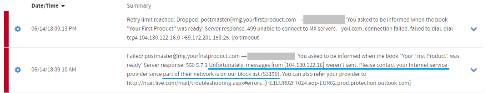
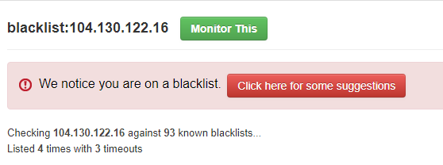
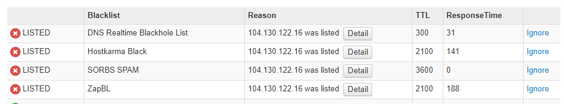

# Mailgun: blocklist

I sent a modest amount of bulk email via Mailgun.

When I looked at the mailgun dashboard <https://app.mailgun.com/app/dashboard> I saw that some **failures** had been recorded.

I went to the `logs` page and saw more detail. It seems that some of the recipients' mail servers (particularly Microsoft ones, e.g. live.com, outlook.com, hotmail.com) refused to accept the email and said:

	"code": 550,
        "message": "5.7.1 Unfortunately, messages from [104.130.122.16] weren't sent. Please contact your Internet service provider since part of their network is on our block list (S3150). You can also refer your provider to http://mail.live.com/mail/troubleshooting.aspx#errors. [HE1EUR02FT024.eop-EUR02.prod.protection.outlook.com]"

		

When I tested that ip address at <https://mxtoolbox.com/blacklists.aspx> 

...it said I was on a few blacklists 

> We notice you are on a blacklist.  Click here for some suggestions
> Checking 104.130.122.16 against 93 known blacklists... 
> Listed 4 times with 3 timeouts 

> A blacklist, alternatively called a DNSBL(DNS blacklist) or RBL(Realtime Blacklist), is a spam blocking list that can prevent a mail server from sending email.

Details for one of those lists said:

> Reason for listing - MTA-Pro Blocklist, visit dnsrbl.org for removal - IP Address: 104.130.122.16

I visited that page and found:

	Query Results
	Spam history for 104.130.122.16 (times in UTC):

	Sun Mar 4 11:40:13 2018	spamtrap hit
	Mon Mar 5 17:45:51 2018	removed from list
	Mon May 7 08:50:06 2018	spamtrap hit
	Fri May 18 05:14:19 2018	removed from list
	Tue Jun 5 23:10:03 2018	spamtrap hit
	Remove IP from DNSRBL

	104.130.122.16
 
 
I clicked on "Remove IP from DNSRBL"

It said:

	Removal Results
	IP address 104.130.122.16 has been removed from the database. It should be gone from DNSRBL after the next zone file rebuild, in a couple of minutes.

	Note that it will be added back the next time it sends email to one of our spam traps.
	
	
And I found...	
	
	More information about Hostkarma Black can be found at their website: http://wiki.junkemailfilter.com/index.php/Spam_DNS_Lists

	Reason for listing - Black listed at hostkarma http://ipadmin.junkemailfilter.com/remove.php?ip=104.130.122.16	
	
I go to the removal page...	
	
	Note: This is a courtesy removal form for those who were either wrongly listed or have fixed the problem and is now ready to be delisted.
	

	IP address 104.130.122.16 returned DNS result code 127.0.0.2.
	104.130.122.16 is Black listed - Click the Search Button Next - then you will get the Remove button.
	Don't email us about being removed. Just use this form.
	

	Your reverse DNS is correct! - mail16.static.mailgun.info
	The IP address for the reverse lookup name matches the original IP - RDNS Information

	This is a list from our log files showing the activity from IP address 104.130.122.16. Our system stores information for 4 days. 

	/ip-log/karma.log.16:black 104.130.122.16 QUIT MULTI-BLACKLIST - [S=3 - hostkarma.junkemailfilter.com] - DOB-SENDER BlList - ID=04559-24370 X=pascal H=mail16.static.mailgun.info [104.130.122.16]:26010 HELO=[mail16.static.mailgun.info] SN=[bounce+a75798.83d79-cherylh=mpropertiesinc.com@justflowe

I clicked the remove button....

	IP address 104.130.122.16 has been scheduled to be removed from the Hostkarma Blacklist. (Generally takes 5 minutes but if others cache the lookup it might take longer to take effect.)	
	
	
Next I tried to clear us from SORBS...

	More information about SORBS SPAM can be found at their website: http://www.sorbs.net/lookup.shtml

	Reason for listing - Spam Received See: http://www.sorbs.net/lookup.shtml?104.130.122.16
	
After entering a captcha I found:

	Problem Entries, (listings will cause email problems.)
	9 "Spam" entries [12:44:27 16 May 2018 GMT+00].	
	104.130.122.16 - 9 entries [12:44:27 16 May 2018 GMT+00].
	
I couldn't delist there because:

<http://www.sorbs.net/cgi-bin/support> says:

	An account is required to proceed!	
	

	
-----

After attempting all of the above I decided to contact mailgun support.

As a preliminary (before lodging a ticket) they said to first try mail-tester. <https://www.mail-tester.com/>

This was a good service! They gave me a score of 10/10 though. (Not sure I deserved it)

And had this helpful advice:
	You're not fully authenticated
		You do not have a DMARC record

		A DMARC policy allows a sender to indicate that their emails are protected by SPF and/or DKIM, and give instruction if neither of those authentication methods passes. Please be sure you have a DKIM and SPF set before using DMARC.
		You do not have a DMARC record, please add a TXT record to your domain _dmarc.yourfirstproduct.com with the following value:

		v=DMARC1; p=none
		Verification details:

		mail-tester.com; dkim=pass (1024-bit key; unprotected) header.d=mg.yourfirstproduct.com header.i=@mg.yourfirstproduct.com header.b=ekymBOx4; dkim-atps=neutral
		mail-tester.com; dmarc=none header.from=yourfirstproduct.com
		mail-tester.com; dkim=pass (1024-bit key; unprotected) header.d=mg.yourfirstproduct.com header.i=@mg.yourfirstproduct.com header.b=ekymBOx4; dkim-atps=neutral
		From Domain: yourfirstproduct.com
		DKIM Domain: mg.yourfirstproduct.com		
		
	You're listed in 1 blacklist
		Listed in SORBS (last 28 days) ( -0.5 )

	Your message does not contain a List-Unsubscribe head
		The List-Unsubscribe header is required if you send mass emails, it enables the user to easily unsubscribe from your mailing list.
		Your message does not contain a List-Unsubscribe header

And this confusing advice:

	Your message could be improved
		Weight of the HTML version of your message: 1KB.
		Your message contains 75% of text.

So I could add DMARC and potentially add a List-Unsubscribe header. I hadn't heard of that before. So it's good to learn about something. 

I looked into how this is done, and it's not as simple as it ought to be. Given that I have a unique https'd URL they can 'get' to be unsubscribed, I thought it's just be a matter of feeding this to a parameter of the API call for mailgun. But alas, they want to "add value" by managing the unsubscribe functionality. 

Here's the ticket I raised at <https://app.mailgun.com/app/support/new>:

	Hello I would like to request:

	IP rotation due to blacklisting

	IP: 
	104.130.122.16

	Message: 
	5.7.1 Unfortunately, messages from [104.130.122.16] weren't sent. Please contact your Internet service provider since part of their network is on our block list (S3150). You can also refer your provider to http://mail.live.com/mail/troubleshooting.aspx#errors. [HE1EUR02FT024.eop-EUR02.prod.protection.outlook.com]

	I checked at mxtoolbox and found the mailgun IP on 4 separate blacklists. This pre-dated my sending of emails, it goes back weeks and weeks. I tried to get it unblocked from all of them. I may have succeeded with 2, but couldn't succeed with all of them.

	please rotate my IP address if possible.

	Is there anything I need to do on my end, with DNS etc?

	kind regards
	Leon Bambrick

...And I attached the images from above.

This may have been overkill, by about 1000% percent, but I don't want to have to email them twice. And since I'm recording what I wrote I can reuse it later.

