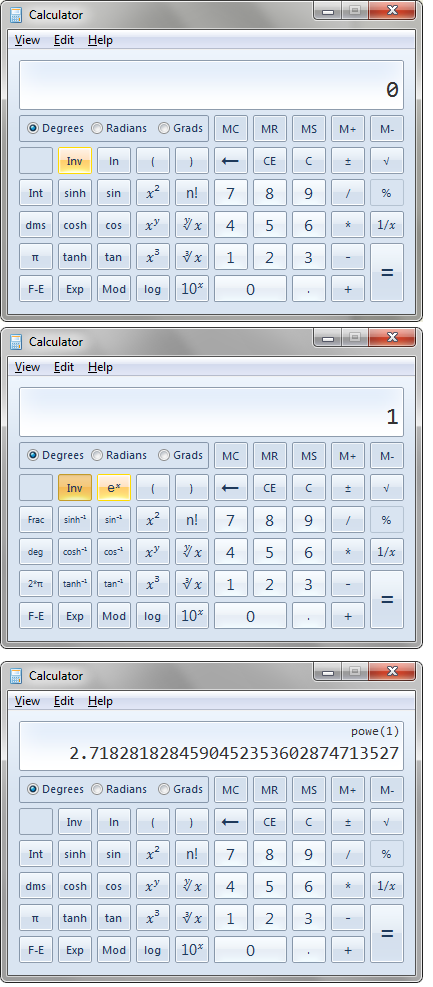

# Euler's Number

`e` is Euler's numbers

Approx. 2.718 it is the limit of (1+1/x)^x  as x approaches infinity.

## How to display e on a scientific calculator.

(How to display Euler's number on a calculator in Windows)

To show it on a scientific calculator... 

You need to use the `e^x` button which is only visible when you click the `Inv` button.

So enter the number `1`. Click `Inv` then `e^x` and you will thus find the value of `e^1`, i.e. `e`.

