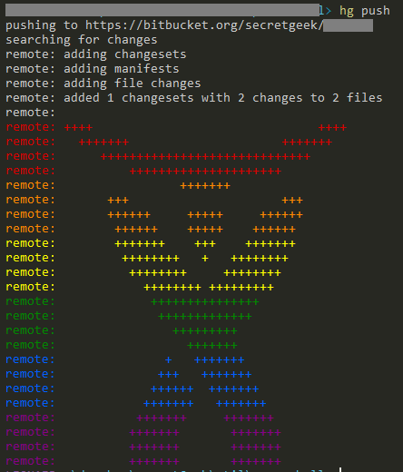

# hg push to bitbucket resulted in a rainbow

This had me completely stumped. What does it mean?

Has bitbucket been hacked? Is my repo corrupted? 

After extensive googling I worked out it's an Atlassian logo (atlassian bought bitbucket a few years ago) drawn in rainbow colors, to celebrate equality, on the anniversary of the US Supreme Court's decision to strike down laws against gay marriage.

I wish there'd been a few words, or even a url included. A picture is worth a thousand words, but a few words can be helpful too.

## References

 * [Atlassian "logo" after pushing to bitbucket](https://stackoverflow.com/questions/31081919/atlassian-logo-after-pushing-to-bitbucket)