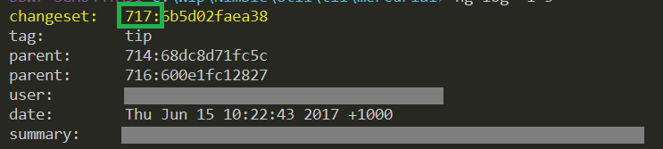
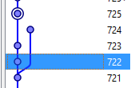
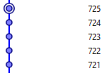

# rebasing in mercurial for dimwits.

## Step 1. Get rebase

First, enable the rebase extension by editing:

	$env:userprofile\mercurial.ini
	
And in the `[extensions]` section, write:

	rebase =

If you *don't* have the extension, then running a rebase, e.g. `hg rebase -s 745 -d 775`, will result in:

	hg: unknown command 'rebase'
	(did you mean one of qrename, rename, resolve?)

Once you've enabled it, confirm you have the rebase extension installed by typing:

	hg help extensions

In the bottom of that output you should see something like:

    enabled extensions:

     color         colorize output from some commands
     extdiff       command to allow external programs to compare revisions
     fetch         pull, update and merge in one command (DEPRECATED)
     mq            manage a stack of patches
     rebase        command to move sets of revisions to a different ancestor **********

## Using rebase

The simplest way to use it is that when you wish to pull and update the repo, instead of using:

    hg pull --update   # <-- don't do this!

Do this instead:	
	
	hg pull --rebase
	
That will change your local revisions to be applied *after* any revs that were performed in remote locations (after you last updated)

Let's say while you were making some local revisions, X,Y&Z:

Meanwhile, let's assume some other turkey (let's call him Richard) was making other revisions, D and E.

You want to linearize your commits, so that X Y and Z follow D and E.

Here's the command:

	hg rebase -s X -d E

You won't use the literal letters "X" and "E". You'll use the revision numbers. i.e. the number that appears before the revision hash:

So your command might be more like:

	$myEarliestCommit = 100
	$otherPeoplesLastCommit = 115
	hg rebase -s $myEarliestCommit -d $otherPeoplesLastCommit

Here's another example.

The repo looked like this:

I'd commited 722 and 723 locally. 

I wanted to move them after 724, which had been done remotely.

I used this command:

    hg rebase -s 722 -d 724        

Which resulted in:

    

The linear history I was after.

    

To see neat `log` (to help with deciding `-s` and `-d`) use:

	hg log --template "{rev}: {desc} {author}\n" -l 10

## One more time

I seem to have written this out previously, so here it is one more time, this time with ascii art.

	hg rebase -s A -d B

Where A is the lowest number of the revisions I've done locally

and B is the highest number of the revisions that have been done remotely.

Once the command is performed A will be rebased to occur straigth after B.

                  -- J (101)--- K (102)--- L (103)--->
                 /
    --- I (100)-
                 \-- M (104)--- N (105)--- O (106)--->

Assume that J,K, and L are my local changes.

M,N, and O are some remote changes I need to 'merge' with. In this case i decide to merge by rebasing.

Since "A is the lowest number of the revisions I've done locally", A = 101

and "B is the highest number of the revisions that have been done remotely", B = 106.

So run this command:

	hg rebase -s 101 -d 106

And end up with:

    --- I (100)--- M (101)--- N (102)--- O (103)--- J (104)--- K (105)--- L (106)--->

Nice and linear

## Source

 * [Rebase Extension](https://www.mercurial-scm.org/wiki/RebaseExtension)