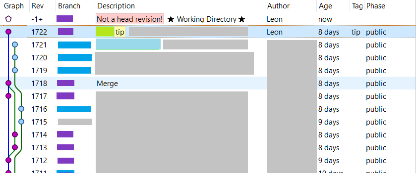

# How to recover when a rebase goes wrong?

Summary:

When attempting

	> hg pull --rebase

If you get an error message such as:

	transaction abort!
	rollback completed

I recommend the following steps...

1. Make a local backup of your repo, in another folder.
2. Perform any `hg unbundle` commands that the error message recommends
3. Try `hg rebase --continue`
4. If that doesn't work, try `hg rebase --abort`

I was worried I would lose my commits when I did this, but I did not. The backup of the repo (step 1) also meant I could try other things if this had failed.

Here's the complete story of what happened (may include error messages that you also experience)

## Background story

I was attempting a rebase....

	> hg pull --rebase
	pulling from \\Reposerver\MonoRepo
	searching for changes
	adding changesets
	adding manifests
	adding file changes
	added 40 changesets with 93 changes to 70 files (+1 heads)
	new changesets 2834af4f058c:9dadf17bcf7c
	rebasing 1723:8c87dc84658a "Some changes1"
	rebasing 1724:54388b19545b "Some changes2"
	rebasing 1725:ccb07e7d5eb2 "Some changes3"
	rebasing 1726:a014168bc3e8 "Some changes4"
	rebasing 1727:bc5366e987f2 "Some changes5"
	saved backup bundle to C:\Source\MonoRepo\.hg\strip-backup/8c87dc84658a-98774a32-rebase.hg
	transaction abort!
	rollback completed
	strip failed, backup bundle stored in 'C:\Source\MonoRepo\.hg\strip-backup/8c87dc84658a-98774a32-rebase.hg'
	strip failed, unrecovered changes stored in 'C:\Source\MonoRepo\.hg\strip-backup/8c87dc84658a-3ac4a696-temp.hg'
	(fix the problem, then recover the changesets with "hg unbundle 'C:\Source\MonoRepo\.hg\strip-backup/8c87dc84658a-3ac4a696-temp.hg'")
	abort: C:\Source\MonoRepo\.hg/store\data/_folder/_project_alpha._tests/_fakes_assemblies/_fakesconfig.i: The process cannot access the file because it is being used by another process

The most pertinent parts are:

	(fix the problem, then recover the changesets with "hg unbundle 'C:\Source\MonoRepo\.hg\strip-backup/8c87dc84658a-3ac4a696-temp.hg'")

And

	"The process cannot access the file because it is being used by another process"

...I think the file wasn't being used by me or any of my apps. Most likely it was onedrive that got its mits on the thing. One Drive shouldn't lock files though. So maybe not One Drive. But my VS instance wasn't touching that area or anywhere near it. No virus scanner running.

Regarding this:

	strip failed,       backup bundle stored in 'C:\Source\MonoRepo\.hg\strip-backup/8c87dc84658a-98774a32-rebase.hg'
	strip failed, unrecovered changes stored in 'C:\Source\MonoRepo\.hg\strip-backup/8c87dc84658a-3ac4a696-temp.hg'

Here's what I get from `stat` at the moment....

	> hg stat
	warning: ignoring unknown working parent f6a8bec6d092!

Looking in tortoise it's quite ugly.

see 

The current working directory is disconnected from all before it and has a big red "not a head revision" tag.

The revision prior to that is from 8 days ago - it's my last push - i.e. the point the rebase would've had to "roll back" to. Missing from this graph is everyone else's commits in those 8 days, and my local commits.

I ran:

	hg recover 'C:\Source\MonoRepo\.hg\strip-backup/8c87dc84658a-98774a32-rebase.hg'

It said:

	adding changesets
	adding manifests
	adding file changes
	added 45 changesets with 403 changes to 360 files
	new changesets 2834af4f058c:f6a8bec6d092
	(run 'hg update' to get a working copy)

Which looked promising!!

Looking in tortoise again -- it looked good.

Latest commit was 11 minutes old, was the work i'd done. and it was rebased to be built on top of other people's commits from 6 hours ago.

In line with the recommendation I ran:

	hg update

but the response was:

	abort: rebase in progress
	(use 'hg rebase --continue' or 'hg rebase --abort')

Hmm. So I tried the first suggestion:

	hg rebase --continue

But it said:

	abort: cannot continue inconsistent rebase
	(use "hg rebase --abort" to clear broken state)

I tried to rebase again....

	> hg pull --rebase
	abort: rebase in progress
	(use 'hg rebase --continue' or 'hg rebase --abort')

At this point I felt like I was in a text adventure game.

I tried to unbundle that other .hg file in `strip-backup` that was mentioned above:

	> hg unbundle 'C:\Source\MonoRepo\.hg\strip-backup/8c87dc84658a-3ac4a696-temp.hg'
	adding changesets
	adding manifests
	adding file changes
	added 0 changesets with 0 changes to 360 files
	(run 'hg update' to get a working copy)

In line with the recommendation I ran:

	hg update

but the response was:

	abort: rebase in progress
	(use 'hg rebase --continue' or 'hg rebase --abort')

In other words: no improvement.

I ran a verify:

	>hg verify
	checking [===================>    ] 1688/18825 07s

It took a while and no result, i.e. it found no issues...

	>hg verify
	checking changesets
	checking manifests
	crosschecking files in changesets and manifests
	checking files
	18825 files, 1768 changesets, 25631 total revisions

Running hg update again:

	> hg update

but the response was:

	abort: rebase in progress
	(use 'hg rebase --continue' or 'hg rebase --abort')

I tried

	> hg debugcheckstate

but still:

	> hg update
	abort: rebase in progress
	(use 'hg rebase --continue' or 'hg rebase --abort')

So I made a copy of my repo in

	C:\apps\Nimble\MonoRepo

...so that I could try `hg rebase --abort` (which *might* lose my changes)

Before doing that I had a poke around in the `.hg` folder.

Look at these files....

	Mode	 LastWriteTime         Length Name
	----	 -------------         ------ ----
	d-----       27/09/2018  10:19 PM	 cache
	d-----        2/08/2018  10:33 AM	 git
	d-----       28/09/2018   8:51 AM	 store
	d-----       27/09/2018  10:07 PM	 strip-backup
	-a----        9/06/2017   3:07 PM             57 00changelog.i
	-a----       26/02/2018  11:29 AM              0 bookmarks
	-a----       16/07/2018   3:48 PM              6 branch
	-a----       25/09/2018   3:58 AM              0 cur-message.txt
	-a----       13/07/2018   4:11 PM        1367419 dirstate
	-a----       16/07/2018   3:45 PM            180 hgrc
	-a----       27/09/2018  10:07 PM             50 last-message.txt
	-a----       27/09/2018  10:07 PM            705 rebasestate
	-a----        9/06/2017   3:07 PM             33 requires
	-a----        7/09/2018   3:27 PM            115 thgstatus
	-a----       26/02/2018  11:29 AM              0 undo.backup.bookmarks
	-a----       13/07/2018   4:11 PM        1367419 undo.backup.dirstate
	-a----       27/09/2018  10:19 PM              0 undo.bookmarks
	-a----       27/09/2018  10:19 PM              5 undo.branch
	-a----       27/09/2018  10:19 PM             14 undo.desc
	-a----       13/07/2018   4:11 PM        1367419 undo.dirstate

The file `00changelog.i` just says:

	dummy changelog to prevent using the old repo layout

The file `branch` says just

	LASERS

...which is the current branch i'm on

And `hgrc` is my repo settings such as the remote location.

The file `last-message.txt` holds a copy of the last commit message i wrote. Makes it easy to reuse i guess.

cat `undo.desc` tells me:

	1768
	unbundle

and `rebasestate` is probably our culprit. Its content in full:

	bc5366e987f2d3de6039d08ce5f124b013bc889f
	0000000000000000000000000000000000000000
	0
	0
	0
	8c87dc84658a144f80526d50a48bfc382059c194:918fe6082c1416e890cd217f5ca7b57337319dfd:9dadf17bcf7ce1295bccef241d07b0adc316e872
	54388b19545bc775818ddbae26ad6d0cac35127d:18827d00a088068c7e123c7049dddcbbcac43b9c:9dadf17bcf7ce1295bccef241d07b0adc316e872
	ccb07e7d5eb2fedb8fe7801da0e7f5f442269ceb:220059d4d0319ae93b486c5b3982d81563d56048:9dadf17bcf7ce1295bccef241d07b0adc316e872
	a014168bc3e8724e373086bc3519940f95dbbc0a:c471776b590c2c92ecb63db72adc116661ed981e:9dadf17bcf7ce1295bccef241d07b0adc316e872
	bc5366e987f2d3de6039d08ce5f124b013bc889f:f6a8bec6d09230424245aad4491a411648e126ed:9dadf17bcf7ce1295bccef241d07b0adc316e872

Okay i've psyched myself up to try what I need to try....

	> hg rebase --abort
	rebase aborted (no revision is removed, only broken state is cleared)

Okay - that looks really good....

Looking at the log, it shows my recent commits and the ones I rebased on top of. Looking in tortoise hg it looks good.

I'm now able to make the minor whitespace commit I wanted to perform as a proof of life.

I run all my tests and then push.

The push seemed to freeze for a while.... I received an email at the same time about a 'global network outage'... but eventually the push finished. The game is over. I have won.

    pushing to \\Reposerver\MonoRepo
    searching for changes
    adding changesets
    adding manifests
    adding file changes
    added 6 changesets with 311 changes to 290 files

=====
