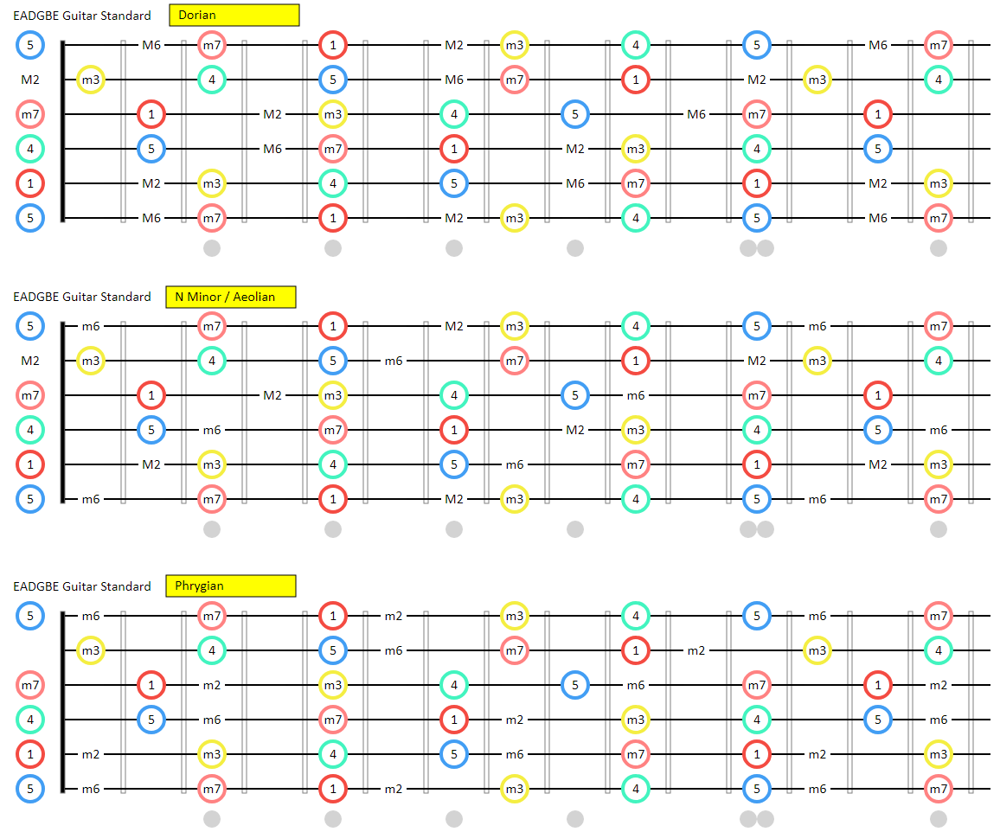

# Guitar Dashboard by Mike Hadlow

Mike Hadlow has created an awesome dashboard for understanding, learning and playing scales/modes on guitar.

* [GuitarDashboard](http://guitardashboard.com/)

His intro to using the tool is here:

* <https://www.youtube.com/watch?v=JPcEvxoWTJM>

and description of how it was created here:

* <http://mikehadlow.blogspot.com/2018/09/what-i-learned-creating-guitar.html>

This could be a more dynamic alternative to the [guitar shapes](guitar_shapes.md) posters I have on my wall.

I've now got this image on the wall of my office:

## How to read the diagram above.

First ignore the circles. Pretend they're completely not present. All that's left are some note names in small black letters. 

The first diagram shows you the position of all the notes in Dorian, in this case in scales that have a tonal center of "A". (But with guitar it's easy to transpose to different scales by shifting up or down... A is just convenient)

The author (Mike Hadlow) eschews the use of Roman numerals though, so instead of `II` and `ii` it says `2M` and `2m` (`2 Major` and `2 minor`).

Now consider the circles. The notes that are circled are the notes of "pentatonic minor". The root note has a red circle. The next note (a minor 3rd) has a yellow circle.

Notice that the circled notes (pentatonic minor) are a *subset* of Dorian. And if you know your pentatonic minor (like many guitarists) you'll clearly see what you can add to pentatonic minor to get Dorian. 

The next diagram does the same for natural minor. (I already had a variation of this diagram on my wall) and the third does the same for Phrygian. 

Dorian, Natural Minor (Aeolian) and Phrygian are all subsets of minor. So they are minor modalities.

## other tools

* [Scale Heaven(https://scale-heaven.com)

## See also

* [Scales and Emotions](scales_and_emotions.md)
* [Guitar Shapes](guitar_shapes.md)
