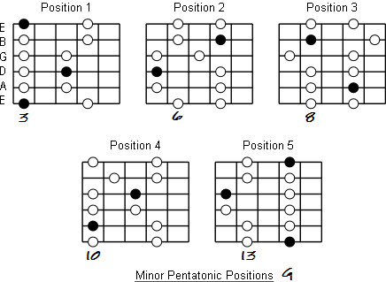
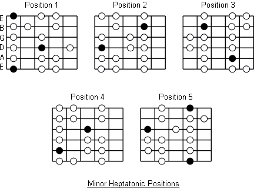
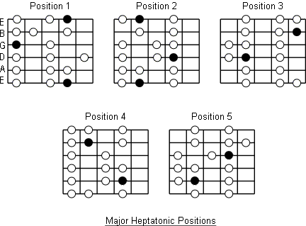

# Some guitar shapes

Here's an empty fretboard. (Only up to the 12th fret)

     0   1   2   3   4   5   6   7   8   9   10  11  12
    e|---|---|---|---|---|---|---|---|---|---|---|---|
    b|---|---|---|---|---|---|---|---|---|---|---|---|
    g|---|---|---|---|---|---|---|---|---|---|---|---|
    d|---|---|---|---|---|---|---|---|---|---|---|---|
    a|---|---|---|---|---|---|---|---|---|---|---|---|
    e|---|---|---|---|---|---|---|---|---|---|---|---|

And here's one up to the 17th.

     0   1   2   3   4   5   6   7   8   9   10  11  12  13  14  15  16  17
    e|---|---|---|---|---|---|---|---|---|---|---|---|---|---|---|---|---|
    b|---|---|---|---|---|---|---|---|---|---|---|---|---|---|---|---|---|
    g|---|---|---|---|---|---|---|---|---|---|---|---|---|---|---|---|---|
    d|---|---|---|---|---|---|---|---|---|---|---|---|---|---|---|---|---|
    a|---|---|---|---|---|---|---|---|---|---|---|---|---|---|---|---|---|
    e|---|---|---|---|---|---|---|---|---|---|---|---|---|---|---|---|---|

Here's a fretboard with all the notes listed

     0   1   2   3   4   5   6   7   8   9   10  11  12  13  14  15  16  17
    e|--f|-f#|--g|-g#|--a|-a#|--b|--c|-c#|--d|-d#|--e|--f|-f#|--g|-g#|--a|
    b|--c|-c#|--d|-d#|--e|--f|-f#|--g|-g#|--a|-a#|--b|--c|-c#|--d|-d#|--e|
    g|-g#|--a|-a#|--b|--c|-c#|--d|-d#|--e|--f|-f#|--g|-g#|--a|-a#|--b|--c|
    d|-d#|--e|--f|-f#|--g|-g#|--a|-a#|--b|--c|-c#|--d|-d#|--e|--f|-f#|--g|
    a|-a#|--b|--c|-c#|--d|-d#|--e|--f|-f#|--g|-g#|--a|-a#|--b|--c|-c#|--d|
    e|--f|-f#|--g|-g#|--a|-a#|--b|--c|-c#|--d|-d#|--e|--f|-f#|--g|-g#|--a|

Here's a simple spare fretbord, with thicker strings shown thick:

    e|-------------
    B|-------------
    G|-------------
    D|=============
    A|=============
    E|=============

And another with some frets drawn in
    
      0   1   2   3 
    e |---|---|---|--
    b |---|---|---|--
    g |---|---|---|--
    d |---|---|---|--
    a |---|---|---|--
    E |---|---|---|--
    
    
Here's a place where you can play A pentatonic minor. You can shift that pattern up or down the neck.
I've marked the root note as R and the V note as capital X.
I call this the 'up' pattern, because it's upward of the root note.

It's also known as 'Position 1'

     0   1   2   3   4   5   6   7   8   9   10  11  12
    e|---|---|---|---|--R|---|---|--x|---|---|---|---|
    b|---|---|---|---|--X|---|---|--x|---|---|---|---|
    g|---|---|---|---|--x|---|--x|---|---|---|---|---|
    d|---|---|---|---|--x|---|--R|---|---|---|---|---|
    a|---|---|---|---|--x|---|--X|---|---|---|---|---|
    e|---|---|---|---|--R|---|---|--x|---|---|---|---|

Or you can play this adjacent shape. Which can also be shifted up or down for different keys.
I think of this as the 'down' pattern.

     0   1   2   3   4   5   6   7   8   9   10  11  12
    e|---|---|--x|---|--R|---|---|---|---|---|---|---|
    b|---|---|--x|---|--X|---|---|---|---|---|---|---|
    g|---|--R|---|---|--x|---|---|---|---|---|---|---|
    d|---|--X|---|---|--x|---|---|---|---|---|---|---|
    a|---|---|--x|---|--x|---|---|---|---|---|---|---|
    e|---|---|--x|---|--R|---|---|---|---|---|---|---|

^^ This is also known as 'Position 5'
    
Within those scales/shapes you can add two notes to take it to A heptatonic minor. See the 'o's below.

     0   1   2   3   4   5   6   7   8   9   10  11  12
    e|---|---|---|---|--R|---|--o|--x|---|---|---|---|
    b|---|---|---|---|--x|--o|---|--x|---|---|---|---|
    g|---|---|---|--o|--x|---|--x|---|---|---|---|---|
    d|---|---|---|---|--x|---|--R|---|---|---|---|---|
    a|---|---|---|---|--x|---|--x|--o|---|---|---|---|
    e|---|---|---|---|--R|---|--o|--x|---|---|---|---|

And for the down pattern  (position 5):

     0   1   2   3   4   5   6   7   8   9   10  11  12
    e|---|---|--x|---|--R|---|---|---|---|---|---|---|
    b|---|---|--x|---|--X|--o|---|---|---|---|---|---|
    g|---|--R|---|--o|--x|---|---|---|---|---|---|---|
    d|---|--X|--o|---|--x|---|---|---|---|---|---|---|
    a|---|--o|--x|---|--x|---|---|---|---|---|---|---|
    e|---|---|--x|---|--R|---|---|---|---|---|---|---|

You can also add a classic 'blue' note to the up pattern like so (marked as 'b'):

     0   1   2   3   4   5   6   7   8   9   10  11  12
    e|---|---|---|---|--R|---|---|--x|---|---|---|---|
    b|---|---|---|(b)|--X|---|---|--x|---|---|---|---|
    g|---|---|---|---|--x|---|--x|--b|(x)|---|---|---|
    d|---|---|---|---|--x|---|--R|---|---|---|---|---|
    a|---|---|---|---|--x|--b|--X|---|---|---|---|---|
    e|---|---|---|---|--R|---|---|--x|---|---|---|---|

The blue note is often played in passing (well, that's how I play it anyway), so I've indicated a few extra locations of this note, which make it easier to slide over this brief note.

This is just how I think on a fretboard. 

Here is a classic way to travel up the board, moving through more than one shape.

     0   1   2   3   4   5   6   7   8   9   10  11  12
    e|---|---|---|---|---|---|---|--x|---|--x|--b|--x|
    b|---|---|---|---|---|---|---|--x|---|--R|---|---|(x)|
    g|---|---|---|---|--x|---|--x|--b|--x|---|---|---|
    d|---|---|---|---|--x|---|--R|---|---|(x)|---|---|
    a|---|---|---|---|--x|--b|--X|---|---|---|---|---|
    e|---|---|---|---|--R|---|---|--x|---|---|---|---|

Here's one part of the fretboard which forms a 'classic' shape, not mentioned above (it's part of position 2) :

     0   1   2   3   4   5   6   7   8   9   10  11  12
    e|---|---|---|---|---|---|---|--x|---|--x|---|---|
    b|---|---|---|---|---|---|---|--x|---|--R|---|---|
    g|---|---|---|---|---|---|---|---|--x|---|---|---|
    d|---|---|---|---|---|---|---|---|---|---|---|---|
    a|---|---|---|---|---|---|---|---|---|---|---|---|
    e|---|---|---|---|---|---|---|---|---|---|---|---|

    
Some blues musicians will noodle around on just those five locations for an entire solo.

(And of course you could shift these patterns up or down to transpose to a different key. This is shown in A)

------

## Pent Minor positions:

------

## "Natural minor" positions

------

## Major (hept) positions

------

## Major Pentatonic Positions

------

## See also

* [Guitar Dashboard](/guitar_dashboard.md)
* [Scales and Emotions](/scales_and_emotions.md)