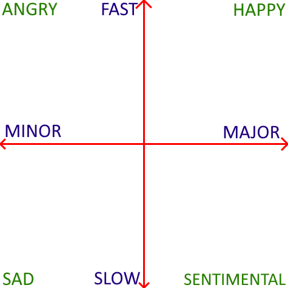

# Scales and emotions

The simplistic version we're told is:

A song in a major scale is happy, a song in a minor scale is sad.

While there's some truth to that, there's also a lot more to it.

First, a more accurate claim would be:

* A fast song in a major scale is happy.
* A slow song in a major scale is sentimental.
* A slow song in a minor scale is sad.
* A fast song in a minor scale is angry.

That's pretty profound stuff!

Here's a depiction of those four quadrants:

Here's my source, an excellent guide!

## Source

* [Scales and Emotions](http://www.ethanhein.com/wp/2010/scales-and-emotions/)

## See also

* [Guitar Dashboard](/Help/guitar_dashboard.md)