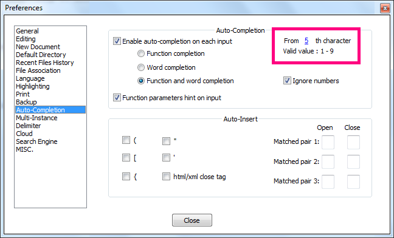

# Disable automatic parens completion.

Notepad++ has this annoying built in feature where it autocompletes quotes brackets angle brackets braces parens parentheses etc.

You type `"`  and it throws in another `"` right away! Stop it already!

> Settings -> Preferences -> Auto-Completion
>
> 2nd grouping called "Auto-Insert", check/un-check the appropriate auto completion/inserts.

Similarly...

In the 

`Settings` &rarr; `Preferences` &rarr; `Auto-Completion`

...area, change auto-completion on each input to be from 5th character, not from 1st character

Note there seems to be a bug in version 7.5.7 where I can't set which character it is from.

So I could only turn off auto complete.

Instead though, I've edited the `config.xml` file stored here:

	cd $env:APPDATA
	cd Notepad++
	FindText auto-compl
	Notepad.exe config.xml
	
        
And changed:

    <GUIConfig name="auto-completion" autoCAction="3" triggerFromNbChar="1" autoCIgnoreNumbers="no" funcParams="yes" />		
	
To

	
	<GUIConfig name="auto-completion" autoCAction="3" triggerFromNbChar="5" autoCIgnoreNumbers="no" funcParams="yes" />

## Source

 * [How to disable annoying 'parenthesis completion'?](http://stackoverflow.com/questions/119387/how-to-disable-annoying-parenthesis-completion)