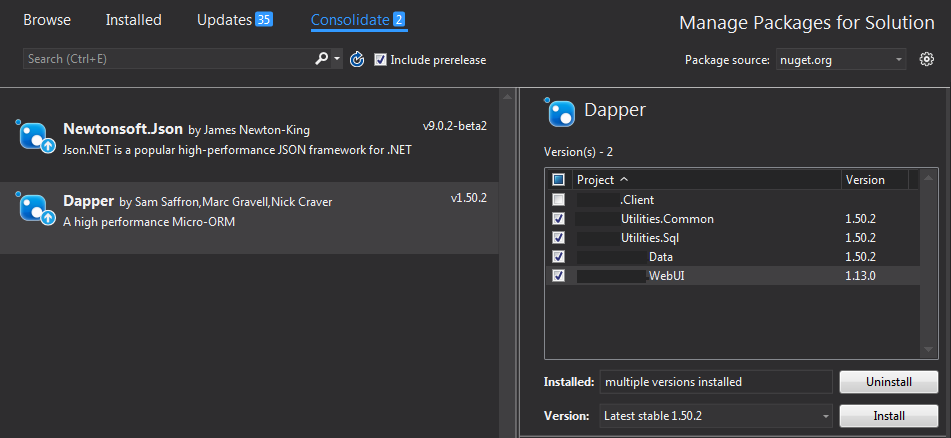

# Projects within a solution use different versions of the same nuget package, consolidate them!

Right click on the solution and choose

    Manage NuGet Packages for Solution...

This brings you to a page with tabs: `Browse`, `Installed`, `Updates` and `Consolidate`

The "Consolidate" page is super handy. It lists any packages which have inconsistent versions across projects.

Click the `Install` button in the lower right to bring them all into line, on the latest version. (Or pick a specific version before pressing `Install`)

