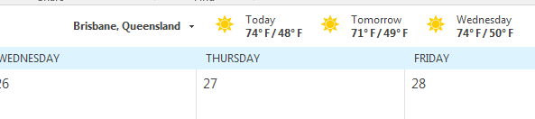
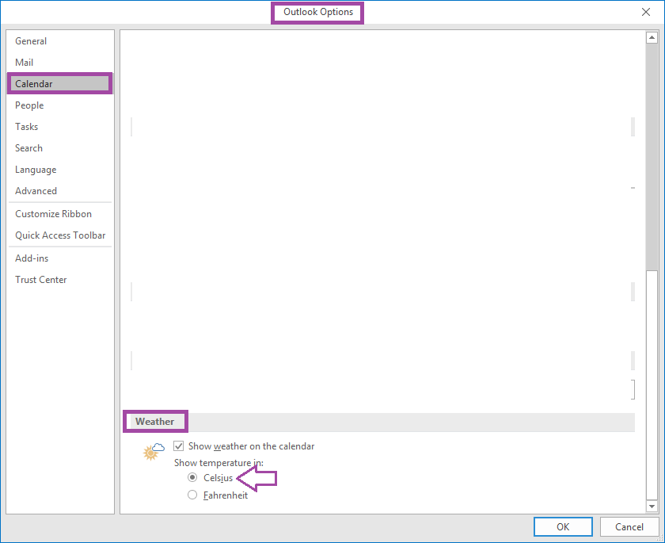

# Show Celsius instead of Fehrenheit in the outlook calendar

I didn't ask for this, but for some reason the Office 365 Outlook calendar tells me about the weather... in washington... in Fahrenheit.

I changed the location to Brisbane Australia, but it continued to use Fahrenheit.

The settings for Celsius/Fahrenheit are under `File | Settings | Calendar | Weather`. see:

