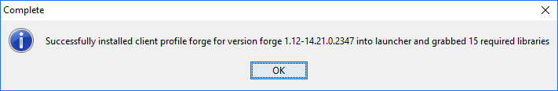

# Python in minecraft

One of my daughters is getting into minecraft. I've heard you can do python in minecraft, so I want to give that a go.

All of the examples below are taken wholly or in part from this awesome guide: [Python Coding for Minecraft by Alex Pruss](http://www.instructables.com/id/Python-coding-for-Minecraft/)

1. Get minecraft for PC

Costs $26.95

2. Minecraft no longer requires java. So you don't need to update that.

> You still technically need Java, but it is now downloaded by the Minecraft launcher and stored with the launcher instead of installed across the entire system. If Minecraft is the only reason you have Java installed, you now have no reason to open up your system to Java vulnerabilities. The Java executable used by Minecraft stays with Minecraft and is as good as invisible and inaccessible to the rest of the system. 

3. Run minecraft launcher.

* "Launch Options"
  * "Add new"
    * Name: (e.g.) Test of 1.9
    * Version:  release 1.9  

On the front screen, on the big green button hit the 'up' arrow to change profile. Select this new profile. And press play.    
    
Make sure it works.

Maybe create a new world, superflat, bonus chest on, cheats on.

    
4. Install Forge.

Default options -- i.e. Client.

It downloads and unpacks a bunch of stuff.

5. Install raspberry jam mod

https://github.com/arpruss/raspberryjammod/releases

RaspberryJamMod-Installer.exe

(22.8MB)

Installing that you need to choose Python 2.7 or 3.x ....

I went with 3.x which I may regret later.

I'm socially progressive and tend to get myself into this kind of problem for fun.

6. Download the latest zip file containing sample Python scripts and the mcpi library from:

	[https://github.com/arpruss/raspberryjammod/releases](https://github.com/arpruss/raspberryjammod/releases)
	
Create a new folder: `$env:AppData\.minecraft\mcpipy`
	
Unzip the file and places its content into the $env:AppData\.minecraft\mcpipy folder.	
	
7. Run minecraft launcher...

pick the 'forge' profile by clicking the up arrow on the green button.

8. 

Run a python script by:

/py {scriptname}

e.g.

/py helloworld

## Hello World!

Here's a helloworld script...

    from mine import *
    mc = Minecraft()
    mc.postToChat("Hello world!")

It outputs the message "Hello world!" to the chat window.	

## Read parameters from input

	say.py:
	
	from mine import *
	from sys import argv
	mc = Minecraft()
	mc.postToChat(argv[1])
	
To use it:
	
	/py say HELLO
	
The screen then says:	

	HELLO
	
Or if you want a message that includes spaces, you'd use:

	/py say "HELLO WORLD"
	
The technique above is very useful if you want to run a script that lets the user decide on something when the script is run (instead of knowing everything when the script is first written)

Sometimes these are called parameters, sometimes they are called arguments.

Here's an advanced trick... if you want to join all of the parameters together into one:

	from mine import *
	from sys import argv
	mc = Minecraft()
    if len(sys.argv) <= 1:
        text = "Hello, world!\nWelcome to Minecraft."
    else:
        del sys.argv[0]
        text = " ".join(sys.argv)
	mc.postToChat(text)
		
	
## Teleport to a location

	from mine import *
	from sys import argv
	mc = Minecraft()
	mc.player.setTilePos(int(argv[1]), int(argv[2]), int(argv[3]))

	
## To find my location:

	/py whereami
	
returns (currently)

	vec3(116,10,9)

Then i can get back there with:

	/py teleport 116 10 9

whereami:
	
	from mine import *
	from sys import argv
	mc = Minecraft()
	mc.postToChat(mc.player.getTilePos())
	

## Place a block

    from mine import *
    mc = Minecraft()
    mc.postToChat("Placing a block...")
    playerPos = mc.player.getPos()
    mc.setBlock(playerPos.x,playerPos.y-1,playerPos.z,block.DIAMOND_ORE)
	
	

## Place 7 blocks....

	from mine import *
	mc = Minecraft()
	mc.postToChat("Placing 7 blocks...")
	playerPos = mc.player.getPos()

	for i in range(7):
		mc.setBlock(playerPos.x + i,playerPos.y-1,playerPos.z,block.DIAMOND_ORE)

## Place as many blocks in a row as you want

With `blockn.py`:

	from mine import *
	from sys import argv
	mc = Minecraft()
	mc.postToChat("Placing argv[1] blocks...")
	playerPos = mc.player.getPos()
	for i in range(int(argv[1])):
		mc.setBlock(playerPos.x + i,playerPos.y-1,playerPos.z,block.DIAMOND_ORE)

Usage:

	/py blockn 30

## Place as many blocks in a row as you want, of a given type 

With `b.py`

	
	from mine import *
	from sys import argv
	mc = Minecraft()
	mc.postToChat("Placing argv[1] blocks of type argv[2]...")
	playerPos = mc.player.getPos()
	specifiedBlock = Block.byName(argv[2])
	for i in range(int(argv[1])):
		mc.setBlock(playerPos.x + i,playerPos.y,playerPos.z,specifiedBlock)
	

Usage:

	/py b 30 GLOWSTONE_BLOCK
	
	
For a list of all block types in minecraft see [blocks in minecraft](blocks_in_minecraft.md)

## Place a rectangle of blocks

	from mine import *
	mc = Minecraft()
	mc.postToChat("Placing a wall...")
	playerPos = mc.player.getPos()

	for i in range(7):
		for j in range(7):
			mc.setBlock(playerPos.x + i,playerPos.y-1,playerPos.z+j,block.DIAMOND_ORE)

## Place a row of blocks of a random type

	import random
	from mine import *
	from sys import argv

	mc = Minecraft()
	mc.postToChat("Placing argv[1] RANDOM blocks...")
	playerPos = mc.player.getPos()
	blocktypes = [ 
		block.STAINED_GLASS_BLACK,
		block.STAINED_GLASS_BLUE,
		block.STAINED_GLASS_BROWN,
		block.STAINED_GLASS_CYAN,
		block.STAINED_GLASS_GRAY,
		block.STAINED_GLASS_GREEN,
		block.STAINED_GLASS_LIGHT_BLUE,
		block.STAINED_GLASS_LIGHT_GRAY,
		block.STAINED_GLASS_LIME,
		block.STAINED_GLASS_MAGENTA,
		block.STAINED_GLASS_ORANGE,
		block.STAINED_GLASS_PINK,
		block.STAINED_GLASS_PURPLE,
		block.STAINED_GLASS_RED,
		block.STAINED_GLASS_WHITE,
		block.STAINED_GLASS_YELLOW,
	]
	for i in range(int(argv[1])):
		mc.setBlock(playerPos.x + i,playerPos.y,playerPos.z,random.choice(blocktypes))

Usage:

	/py randomblocks 10
		
....Places a row of 10 blocks in different stained glass colors.

		
## Make a pyramid

## Run python commands in the minecraft console

See console.py
		
## Sources

 * [Minecraft Doesn't Need Java Installed Anymore](https://www.howtogeek.com/210907/minecraft-doesnt-need-java-installed-anymore-its-time-to-remove-it/)
 * [Instructables: Python Coding for Minecraft by arpruss](http://www.instructables.com/id/Python-coding-for-Minecraft/)