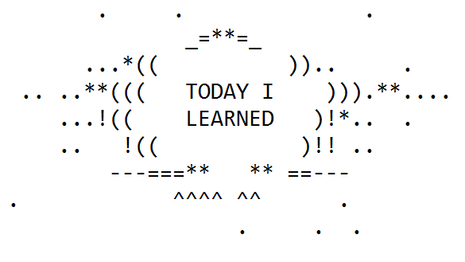
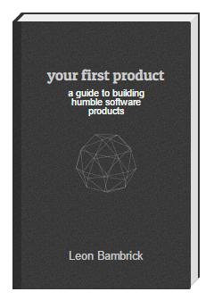

# Today I Learned

This is a place where I store short descriptions of things I learn each day.
 &mdash;Leon Bambrick.

Available as an online gitbook: http://TIL.secretGeek.net/ and as [pdf](https://www.gitbook.com/download/pdf/book/secretgeek/til), [epub](https://www.gitbook.com/download/epub/book/secretgeek/til) and [mobi](https://www.gitbook.com/download/mobi/book/secretgeek/til)

Repository here: https://github.com/secretGeek/til

## Guidelines

Should be factoids that you expect to need to refer to again. Hence, any factoid that is "Well that's interesting!" but would *never* be referenced again is NOT wanted here. So they mostly end up being technical things (though the [concepts](concepts/01_summary.md) category is a major exception).

The folder structure means things are categorised by ONE main topic, not tagged with endless topics/subtopics.

## Inspired by

 * https://github.com/jbranchaud/til -- as seen on https://news.ycombinator.com/item?id=11068902
 * https://github.com/thoughtbot/til
 * https://github.com/jwworth/til

## See Also

 * http://wiki.secretGeek.net (wiki for things I find fascinating)
 * http://www.secretGeek.net (blog)
 
## The real book I am writing...

Though this site is published as a free book, there is another book, a real book, that I am working on.
 
**[Your First Product](http://YourFirstProduct.com)** will help would-be product creators to realise their dream. If you are at all interested in building products, please sign up at [http://YourFirstProduct.com](http://YourFirstProduct.com). Thank you.

## Topics

|Topic|# Articles|
|-----|----------|
| [.net](.net/01_summary.md) | 4 articles |
 | [.net core MVC](.net_core_MVC/01_summary.md) | 12 articles |
 | [appharbor](appharbor/01_summary.md) | 1 article |
 | [asp.net mvc](asp.net_mvc/01_summary.md) | 10 articles |
 | [banking](banking/01_summary.md) | 1 article |
 | [bower](bower/01_summary.md) | 2 articles |
 | [chocolatey](chocolatey/01_summary.md) | 4 articles |
 | [concepts](concepts/01_summary.md) | 13 articles |
 | [console](console/01_summary.md) | 5 articles |
 | [cpu analyzer](cpu_analyzer/01_summary.md) | 1 article |
 | [css](css/01_summary.md) | 2 articles |
 | [electron](electron/01_summary.md) | 2 articles |
 | [excel](excel/01_summary.md) | 3 articles |
 | [git](git/01_summary.md) | 9 articles |
 | [gitbook](gitbook/01_summary.md) | 7 articles |
 | [gmail](gmail/01_summary.md) | 1 article |
 | [google](google/01_summary.md) | 8 articles |
 | [graphics](graphics/01_summary.md) | 7 articles |
 | [gulp](gulp/01_summary.md) | 1 article |
 | [html](html/01_summary.md) | 1 article |
 | [iis](iis/01_summary.md) | 2 articles |
 | [itunes](itunes/01_summary.md) | 1 article |
 | [javascript](javascript/01_summary.md) | 6 articles |
 | [jekyll](jekyll/01_summary.md) | 1 article |
 | [jquery](jquery/01_summary.md) | 3 articles |
 | [linqpad](linqpad/01_summary.md) | 8 articles |
 | [linux](linux/01_summary.md) | 25 articles |
 | [macbook air](macbook_air/01_summary.md) | 4 articles |
 | [markdown](markdown/01_summary.md) | 3 articles |
 | [math](math/01_summary.md) | 2 articles |
 | [memorize](memorize/01_summary.md) | 2 articles |
 | [mercurial](mercurial/01_summary.md) | 14 articles |
 | [minecraft](minecraft/01_summary.md) | 3 articles |
 | [music](music/01_summary.md) | 8 articles |
 | [node](node/01_summary.md) | 1 article |
 | [notepad++](notepad++/01_summary.md) | 8 articles |
 | [npm](npm/01_summary.md) | 7 articles |
 | [nuget](nuget/01_summary.md) | 1 article |
 | [office](office/01_summary.md) | 1 article |
 | [oracle](oracle/01_summary.md) | 5 articles |
 | [paypal](paypal/01_summary.md) | 1 article |
 | [powershell](powershell/01_summary.md) | 58 articles |
 | [python](python/01_summary.md) | 8 articles |
 | [react](react/01_summary.md) | 2 articles |
 | [redis](redis/01_summary.md) | 2 articles |
 | [saltwater swimming pool](saltwater_swimming_pool/01_summary.md) | 2 articles |
 | [security virus spam etc](security_virus_spam_etc/01_summary.md) | 2 articles |
 | [sharepoint](sharepoint/01_summary.md) | 1 article |
 | [smallbasic](smallbasic/01_summary.md) | 1 article |
 | [speech](speech/01_summary.md) | 1 article |
 | [sql server](sql_server/01_summary.md) | 33 articles |
 | [sql server reporting services](sql_server_reporting_services/01_summary.md) | 2 articles |
 | [sql spatial](sql_spatial/01_summary.md) | 2 articles |
 | [stackexchange](stackexchange/01_summary.md) | 3 articles |
 | [tools](tools/01_summary.md) | 3 articles |
 | [typescript](typescript/01_summary.md) | 1 article |
 | [virtual box](virtual_box/01_summary.md) | 2 articles |
 | [visual studio](visual_studio/01_summary.md) | 6 articles |
 | [vs code](vs_code/01_summary.md) | 4 articles |
 | [windows](windows/01_summary.md) | 13 articles |
 | [windows.forms](windows.forms/01_summary.md) | 4 articles |
 | [wordpress](wordpress/01_summary.md) | 1 article |

351 articles
74893 words
