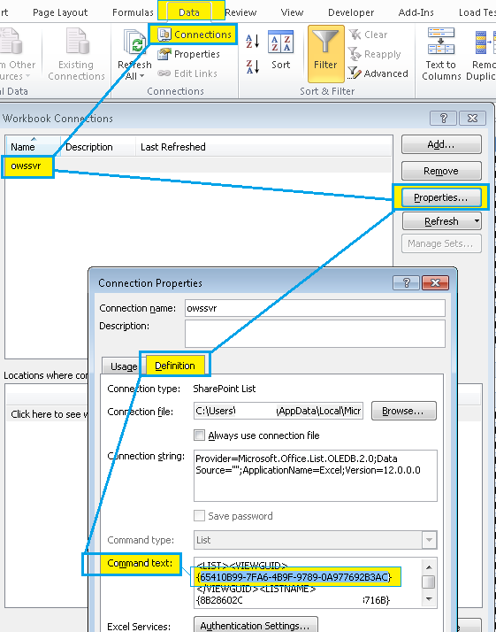

# Find view guid

It can be hard to find the guid of a list, if you don't have many permissions (I have very little permissions in this list) 

But if you export a list to Excel: 

It will embed the guid in the data connection properties

Bit convoluted, but there it is.

