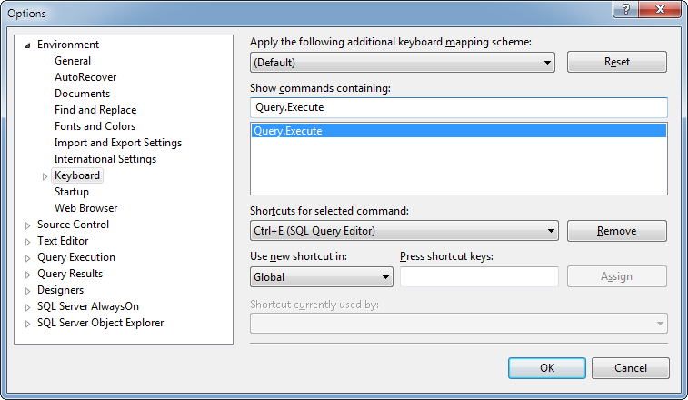

# Use Ctrl-E to execute your query

I'm very used to using Ctrl-E to execute my query.

In a recent version of SQL Server Management Studio this key combo was no longer mapped.

To get it mapped again:

	
	Tools | Options | Environment | Keyboard | Query.Execute
	
Go into "Press shortcut keys", hit Ctrl-E and it'll show you that you're overwriting the combo for word wrap or something.

Do it!
	
	