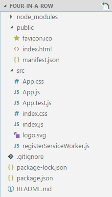

# Tutorial results: trying 'FOUR IN A ROW WITH BOARDGAME.IO'

This is a new TIL series... publishing what happened when i try to follow a tutorial.

This tutorial is [FOUR IN A ROW WITH BOARDGAME.IO](https://www.lonesomecrowdedweb.com/blog/four-in-a-row-boardgameio/) by Brisbane software developer Patrick Johannessen. I've met Patrick a few times, and I thought this was a really compelling example both of React and of boardgame.io. The source code is here: <https://github.com/PJohannessen/four-in-a-row>

Every time I follow a tutorial online I make copious notes in my workbook (my field journal, my scientific journal, my grail diary; call it what you will), just like the ones below. Normally I don't publish them because of the extra effort of worrying about whether i'm violating copyright when i copy slabs of text etc. But in this case I'd like to share the output and might do the same for other tutorials I follow as well.

	npm install -g create-react-app

....on windows: works ok i think.

if it fails too horribly on windows I can try the whole thing on linux instead. let's see...

	C:\Users\Leon\AppData\Roaming\npm\create-react-app -> C:\Users\Leon\AppData\Roaming\npm\node_modules\create-react-app\index.js
	C:\Users\Leon\AppData\Roaming\npm
	+-- create-react-app@1.4.3
	  +-- commander@2.12.2

	create-react-app four-in-a-ro
	
	
^^^ accidentally ran it for the wrong folder! Still let's see what happens:

	Creating a new React app in C:\users\leon\dropbox\secretgeek\all_someday_projects\four-in-a-ro.

	You are using Node v5.4.1 so the project will be bootstrapped with an old unsupported version of tools.

	Please update to Node 6 or higher for a better, fully supported experience.

	Installing packages. This might take a couple of minutes.
	Installing react, react-dom, and react-scripts...
	
	
	
Hmmm, `Please update to Node 6 or higher for a better, fully supported experience.`

How to update Node on windows????

Google shows this result from StackOverflow:

	This works fine for me to update npm on Windows 7 x64:
	Windows start.
	All Programs.
	Node.js.
	Node.js command prompt (alternative click)
	Run as administrator. $ npm -g install npm.
	remove C:\Program Files\nodejs\npm.cmd the new npm will be at C:\Users\username\appdata\roaming\npm\npm.cmd.
	How do I update Node.js and npm on Windows? - Stack Overflow
	https://stackoverflow.com/questions/.../how-do-i-update-node-js-and-npm-on-windows
	
	[How do I update Node.js and npm on Windows?](https://stackoverflow.com/questions/18412129/how-do-i-update-node-js-and-npm-on-windows)
	
But when I click through I get this as the best answer:

	This is the new best way to upgrade npm on Windows.

	Run PowerShell as Administrator

	Set-ExecutionPolicy Unrestricted -Scope CurrentUser -Force
	npm install -g npm-windows-upgrade
	npm-windows-upgrade
	Note: Do not run npm i -g npm. Instead use npm-windows-upgrade to update npm going forward. Also if you run the NodeJS installer, it will replace the node version.

	Upgrades npm in-place, where node installed it.
	Easy updating, update to the latest by running npm-windows-upgrade -p -v latest.
	Does not modify the default path.
	Does not change the default global package location.
	Allows easy upgrades and downgrades.
	Officially recommended by the NPM team.
	A list of versions matched between NPM and NODE (https://nodejs.org/en/download/releases/) - but you will need to download NODE INSTALLER and run that to update node (https://nodejs.org/en/)	

	
Okay so i went to privileged powershell and ran the command to update npm (not noticing yet that to update node itself you need to run an installer which updates both)

	> npm install -g npm-windows-upgrade
	C:\Users\Leon\AppData\Roaming\npm\npm-windows-upgrade -> C:\Users\Leon\AppData\Roaming\npm\node_modules\npm-windows-upgrade\bin\npm-windows-upgrade.js
	C:\Users\Leon\AppData\Roaming\npm
	+-- npm-windows-upgrade@4.1.0
	  +-- babel-polyfill@6.26.0
	  ¦ +-- babel-runtime@6.26.0
	  ¦ ¦ +-- regenerator-runtime@0.11.1
	  ¦ +-- core-js@2.5.3
	  ¦ +-- regenerator-runtime@0.10.5
	  +-- chalk@2.3.0
	  ¦ +-- ansi-styles@3.2.0
	  ¦ ¦ +-- color-convert@1.9.1
	  ¦ ¦   +-- color-name@1.1.3
	  ¦ +-- escape-string-regexp@1.0.5
	  ¦ +-- supports-color@4.5.0
	  ¦   +-- has-flag@2.0.0
	  +-- cli-spinner@0.2.7
	  +-- commander@2.11.0
	  +-- debug@3.1.0
	  ¦ +-- ms@2.0.0
	  +-- inquirer@3.3.0
	  ¦ +-- ansi-escapes@3.0.0
	  ¦ +-- cli-cursor@2.1.0
	  ¦ ¦ +-- restore-cursor@2.0.0
	  ¦ ¦   +-- onetime@2.0.1
	  ¦ ¦   ¦ +-- mimic-fn@1.1.0
	  ¦ ¦   +-- signal-exit@3.0.2
	  ¦ +-- cli-width@2.2.0
	  ¦ +-- external-editor@2.1.0
	  ¦ ¦ +-- chardet@0.4.2
	  ¦ ¦ +-- iconv-lite@0.4.19
	  ¦ ¦ +-- tmp@0.0.33
	  ¦ ¦   +-- os-tmpdir@1.0.2
	  ¦ +-- figures@2.0.0
	  ¦ +-- lodash@4.17.4
	  ¦ +-- mute-stream@0.0.7
	  ¦ +-- run-async@2.3.0
	  ¦ ¦ +-- is-promise@2.1.0
	  ¦ +-- rx-lite@4.0.8
	  ¦ +-- rx-lite-aggregates@4.0.8
	  ¦ +-- string-width@2.1.1
	  ¦ ¦ +-- is-fullwidth-code-point@2.0.0
	  ¦ +-- strip-ansi@4.0.0
	  ¦ ¦ +-- ansi-regex@3.0.0
	  ¦ +-- through@2.3.8
	  +-- prompt@1.0.0
	  ¦ +-- colors@1.1.2
	  ¦ +-- pkginfo@0.4.1
	  ¦ +-- read@1.0.7
	  ¦ +-- revalidator@0.1.8
	  ¦ +-- utile@0.3.0
	  ¦ ¦ +-- async@0.9.2
	  ¦ ¦ +-- deep-equal@0.2.2
	  ¦ ¦ +-- i@0.3.6
	  ¦ ¦ +-- mkdirp@0.5.1
	  ¦ ¦ ¦ +-- minimist@0.0.8
	  ¦ ¦ +-- ncp@1.0.1
	  ¦ ¦ +-- rimraf@2.6.2
	  ¦ ¦   +-- glob@7.1.2
	  ¦ ¦     +-- fs.realpath@1.0.0
	  ¦ ¦     +-- inflight@1.0.6
	  ¦ ¦     ¦ +-- wrappy@1.0.2
	  ¦ ¦     +-- inherits@2.0.3
	  ¦ ¦     +-- minimatch@3.0.4
	  ¦ ¦     ¦ +-- brace-expansion@1.1.8
	  ¦ ¦     ¦   +-- balanced-match@1.0.0
	  ¦ ¦     ¦   +-- concat-map@0.0.1
	  ¦ ¦     +-- once@1.4.0
	  ¦ ¦     +-- path-is-absolute@1.0.1
	  ¦ +-- winston@2.1.1
	  ¦   +-- async@1.0.0
	  ¦   +-- colors@1.0.3
	  ¦   +-- cycle@1.0.3
	  ¦   +-- eyes@0.1.8
	  ¦   +-- isstream@0.1.2
	  ¦   +-- pkginfo@0.3.1
	  ¦   +-- stack-trace@0.0.10
	  +-- regenerator-runtime-only@0.8.38
		+-- es6-symbol@2.0.1
		¦ +-- d@0.1.1
		¦ +-- es5-ext@0.10.37
		¦   +-- es6-iterator@2.0.3
		¦   ¦ +-- d@1.0.0
		¦   ¦ +-- es6-symbol@3.1.1
		¦   +-- es6-symbol@3.1.1
		¦     +-- d@1.0.0
		+-- promise@6.1.0
		  +-- asap@1.0.0

Versions at this stage:
		  
	> node --version
	v5.4.1

	> npm --version
	3.3.12
		  
Now getting latest node from here: https://nodejs.org/en/  (node 8.9.4 at this moment 7:47 AM Sunday, 7 January 2018 )

Installed. 

	> node --version
	v8.9.4

	> npm --version
	5.6.0
	
	
Stackoverflow answer was so ridiculous. First 90% of the answer is about updating just npm -- but to update node you need to run the installer which updates both node and npm. And the installer (msi) gives you a more up to date version of npm than the `npm install -g npm-windows-upgrade` package gives you.

Anyway -- now back to the first command from the tutorial

	> npm install -g create-react-app
	C:\Users\Leon\AppData\Roaming\npm\create-react-app -> C:\Users\Leon\AppData\Roaming\npm\node_modules\create-react-app\index.js
	+ create-react-app@1.4.3
	updated 1 package in 8.322s

Ookay -- create app....

	> create-react-app four-in-a-row

	Creating a new React app in C:\users\leon\dropbox\secretgeek\all_someday_projects\tutorials\four-in-a-row.

	Installing packages. This might take a couple of minutes.
	Installing react, react-dom, and react-scripts...

	> uglifyjs-webpack-plugin@0.4.6 postinstall C:\users\leon\dropbox\secretgeek\all_someday_projects\tutorials\four-in-a-row\node_modules\uglifyjs-webpack-plugin
	> node lib/post_install.js

	+ react-dom@16.2.0
	+ react@16.2.0
	+ react-scripts@1.0.17
	added 1159 packages in 227.933s

	Success! Created four-in-a-row at C:\users\leon\dropbox\secretgeek\all_someday_projects\tutorials\four-in-a-row
	Inside that directory, you can run several commands:

	  npm start
		Starts the development server.

	  npm run build
		Bundles the app into static files for production.

	  npm test
		Starts the test runner.

	  npm run eject
		Removes this tool and copies build dependencies, configuration files
		and scripts into the app directory. If you do this, you can’t go back!

	We suggest that you begin by typing:

	  cd four-in-a-row
	  npm start

	Happy hacking!
	
	
Okay -- looks like we've gotten somewhere now.

	cd four-in-a-row
	
And....

	> npm install --save boardgame.io

	> uws@0.14.5 install C:\users\leon\dropbox\secretgeek\all_someday_projects\tutorials\four-in-a-row\node_modules\uws
	> node-gyp rebuild > build_log.txt 2>&1 || exit 0

	npm WARN optional SKIPPING OPTIONAL DEPENDENCY: fsevents@1.1.2 (node_modules\fsevents):
	npm WARN notsup SKIPPING OPTIONAL DEPENDENCY: Unsupported platform for fsevents@1.1.2: wanted {"os":"darwin","arch":"any"} (current: {"os":"win32","arch":"x64"})

	+ boardgame.io@0.15.0
	added 122 packages in 125.243s
	
Hmm -- hope the lack of fsevents doesn't kill this thing -- though it's likely it will and i'll be switching to linux soon.

What is `fsevents` ? see https://www.npmjs.com/package/fsevents

	The FSEvents API in OS X allows applications to register for notifications of changes to a given directory tree. It is a very fast and lightweight alternative to kqueue.
	
THe file structure at this point looks pretty good: 

 

And matches the one from the tutorial.

I also want to set up the 'end state' for comparison -- so i've cloned the source 

	> git clone https://github.com/PJohannessen/four-in-a-row.git
	Cloning into 'four-in-a-row'...
	remote: Counting objects: 36, done.
	remote: Compressing objects: 100% (29/29), done.
	emote: Total 36 (delta 8), reused 30 (delta 6), pack-reused 0
	Unpacking objects: 100% (36/36), done.
	Checking connectivity... done.	
	
	> cd .\four-in-a-row\
	
Now running `npm install` so i can heat my house.

	> npm install

	> uws@0.14.5 install C:\users\leon\dropbox\secretgeek\all_someday_projects\git_playground\four-in-a-row\node_modules\uws
	> node-gyp rebuild > build_log.txt 2>&1 || exit 0

	> uglifyjs-webpack-plugin@0.4.6 postinstall C:\users\leon\dropbox\secretgeek\all_someday_projects\git_playground\four-in-a-row\node_modules\uglifyjs-webpack-plugin
	> node lib/post_install.js

	added 1280 packages in 260.013s
	
And... npm run:

	Compiled with warnings.

	C:/Users/Leon/Dropbox/secretGeek/all_someday_projects/git_playground/four-in-a-row/node_modules/object-assign/index.js
	There are multiple modules with names that only differ in casing.
	This can lead to unexpected behavior when compiling on a filesystem with other case-semantic.
	Use equal casing. Compare these module identifiers:
	* C:\Users\Leon\Dropbox\secretGeek\all_someday_projects\git_playground\four-in-a-row\node_modules\object-assign\index.js
		Used by 1 module(s), i. e.
		C:\Users\Leon\Dropbox\secretGeek\all_someday_projects\git_playground\four-in-a-row\node_modules\react-scripts\config\polyfills.js
	* C:\users\leon\dropbox\secretgeek\all_someday_projects\git_playground\four-in-a-row\node_modules\object-assign\index.js
		Used by 2 module(s), i. e.
		C:\users\leon\dropbox\secretgeek\all_someday_projects\git_playground\four-in-a-row\node_modules\react-dom\cjs\react-dom.development.js

	C:/Users/Leon/Dropbox/secretGeek/all_someday_projects/git_playground/four-in-a-row/node_modules/process/browser.js
	There are multiple modules with names that only differ in casing.
	This can lead to unexpected behavior when compiling on a filesystem with other case-semantic.
	Use equal casing. Compare these module identifiers:
	* C:\Users\Leon\Dropbox\secretGeek\all_someday_projects\git_playground\four-in-a-row\node_modules\process\browser.js
		Used by 3 module(s), i. e.
		C:\Users\Leon\Dropbox\secretGeek\all_someday_projects\git_playground\four-in-a-row\node_modules\chalk\index.js
	* C:\users\leon\dropbox\secretgeek\all_someday_projects\git_playground\four-in-a-row\node_modules\process\browser.js
		Used by 1 module(s), i. e.
		C:\users\leon\dropbox\secretgeek\all_someday_projects\git_playground\four-in-a-row\node_modules\boardgame.io\dist\client.js

	(webpack)/buildin/global.js
	There are multiple modules with names that only differ in casing.
	This can lead to unexpected behavior when compiling on a filesystem with other case-semantic.
	Use equal casing. Compare these module identifiers:
	* C:\Users\Leon\Dropbox\secretGeek\all_someday_projects\git_playground\four-in-a-row\node_modules\webpack\buildin\global.js
		Used by 23 module(s), i. e.
		C:\Users\Leon\Dropbox\secretGeek\all_someday_projects\git_playground\four-in-a-row\node_modules\punycode\punycode.js
	* C:\users\leon\dropbox\secretgeek\all_someday_projects\git_playground\four-in-a-row\node_modules\webpack\buildin\global.js
		Used by 1 module(s), i. e.
		C:\users\leon\dropbox\secretgeek\all_someday_projects\git_playground\four-in-a-row\node_modules\boardgame.io\dist\client.js

	Search for the keywords to learn more about each warning.
	To ignore, add // eslint-disable-next-line to the line before.

App works a treat:

	http://localhost:3000/

Ok -- back to the tutorial.

