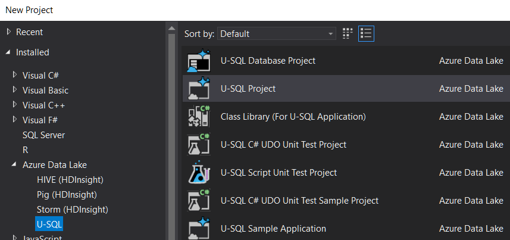

# What is U-SQL

U-SQL is a language that Unifies SQL and C# (using Roslyn compiler).

Queries can be executed  against a Local Execution context or a Cloud Execution Context.

The language combines SQL keywords (strictly in UPPER case) with C# keywords (in C#'s case-sensitive manner)

Queries are automatically run in parallel (where possible) with ability to control the max degree of parallelism.

## Why though?

Instead of bringing the data to your code, you can **send your code to the data!** Much more efficient for huge datasets.

Simple example:

Open Visual Studio 2017, new project, under Azure Data Lake, select "U-SQL" project

Create a new query and run it against a local execution context.

Any paths mentioned in the query will be relevant to the local `USQLDataRoot`, i.e.

    ~\AppData\Local\USQLDataRoot

Example query:

  
    @t = EXTRACT 
            name string, age int
         FROM "fred.csv"
         USING Extractors.Csv(skipFirstNRows:1);

    @g =
        SELECT 
               name.ToLower().ToUpper().ToLower() AS name_lower, 
               USQLApplication1.Udfs.Transformo(name) AS name_transformed, 
               *
        FROM @t;

    OUTPUT @g TO
              "fred3.tsv"
             USING Outputters.Tsv();

Things to note... "EXTRACT" command is a lot like a `SELECT` but specifies an 'extractor'. The extractor here is one of the [built-in extractors](https://docs.microsoft.com/en-us/u-sql/functions/operators/built-in-extractors). You can also build your own if you have a custom file to read.

The [`Extractors.Csv`](https://docs.microsoft.com/en-us/u-sql/functions/operators/extractors/extractors-csv) class accepts optional parameters (see [all parameters](https://docs.microsoft.com/en-us/u-sql/functions/operators/extractors/extractor-parameters)). I don't have intellisense working on that currently.

Gotcha: by default it expects there to be no header row. So you need to tell it to skip the header if there is a header row. (i.e. `skipFirstNRows: 1`)

Gotcha: even if they are quoted, you cannot have literal carriage returns/line feeds inside csv file, if you hope to use the `Extractors.Csv()`. They must instead be escaped by being replaced with '\r' and '\n'. This is to allow for parallelization, so that rows can be processed in any order (without processing prior rows). see [issue 84](https://github.com/Azure/usql/issues/84)

There is no schema information about the csv file. You define the schema (the type details) in the extract command. This is called **"Schema on load"**. Note the use of .net types, e.g. `string` not `nvarchar`.

Each of those variables, `@t`, `@g`, is a data row set.

It is an error to not use all the data row sets. If you create one but doing nothing with it, you get the error: "This statement is dead code".

After extracting it from the file we do some transformations. Note the use of .net functions such as `.ToLower()`.

We can use custom methods defined in a 'code behind' file. The example above is: "USQLApplication1.Udfs.Transformo(name) " where the usql file is 'Script.usql' and it's code behind file is thus `Script.usql.cs` and contains this C# class:

    namespace USQLApplication1
    {
        public class Udfs {
            public static string Transformo(string name)
            {
                return name.ToUpper();
            }
        }
    }

Other than code-behind files, We can also load assemblies into a database in SQL Azure Data Lake, and reference those assemblies, thus sharing more complex logic.

