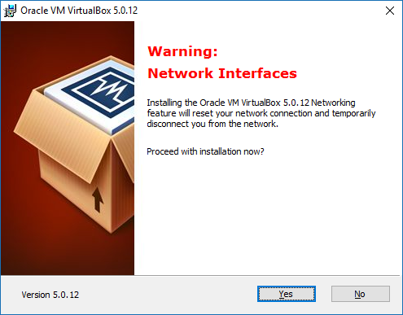

# Virtual Box  warning during installation

During installation of virtual box, this warning is designed to cause maximum fright

> Warning: Network Interfaces
> Installing the Oracle VM VirtualBox 5.0.12 Networking
> feature will reset your network connection and temporarily 
> disconnect you from the network.
>
> Proceed with installation now?  
> Yes or NO

Like the badass that I am, I clicked yes. If I did go offline I didn't notice. It was over in less than 2 minutes.