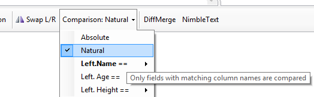

# The one where I had to write my own ToolstripItemRenderer to get around a 'closed won't fix' bug in Windows Forms

Breakdown of time spent adding a new feature in [NimbleSET](http://nimbletext.com/SET/About/):

* Time spent writing the feature (implementing natural join, absolute joins, and a hierarchy of possible column joins) 3 hours.
* Time Spent getting Tooltips and tab order correct and consistent: 1 hour.
* Time spent working around a bug in the framework that was resolved as 'closed, won't fix' in 2006. 4 hours. (details below).
* Time spent blogging about it and subsequently finding other improvements to the code: 1 hour.

So the bug in the framework is that if a `toolbarstrip` has large icons (e.g. `ToolStrip.ImageScalingSize = new Size(32, 32);`), then 'Checked' items won't render correctly in a child dropdown list of that `toolbarstrip`. Obscure? Yep.

(See the clipped checkmark next to the word 'Natural' that is rendered in the wrong place? That's why shipping software is hard.)

It's obscure enough that it got [0 upvotes and 0 repros](https://connect.microsoft.com/VisualStudio/feedback/details/196480/toolstrip-dropdown-buttons-scale-images-checkboxes-incorrectly-with-toolstrip-imagescalingsize-32x32) on Connect. The workaround provided there wasn't enough to solve it properly. (Incidentally when I visit that page now I get a 400 error, but when i visit from an incognito browser it works... so I suspect I'm sending like a billion old cookies or something...)

What I needed to do was write my own `ToolStripProfessionalRenderer`, and override the `OnRenderItemCheck` method.

If you want to create your own renderer, avoid the advice that says to inherit from `ToolStripRenderer`, you want to inherit from `ToolStripProfessionalRenderer` instead, like so:

    public class CustomToolStripRenderer : System.Windows.Forms.ToolStripProfessionalRenderer
    {
    }

And be sure to tell your control that you want to use your custom renderer, like this:

    mainToolStrip.Renderer = new CustomToolStripRenderer();
            
Then within the custom renderer, you can override whichever method you're unhappy with.

Here's the code I wrote to draw a little blue box, and a custom tick, that should be a pixel-perfect representation of the intended one. I just know there are going to be edge cases (e.g. custom DPI) that will break this.

    protected override void OnRenderItemCheck(ToolStripItemImageRenderEventArgs e)
    {
        var g = e.Graphics;
        var fillColor = (e.Item.Selected ? this.ColorTable.CheckSelectedBackground : this.ColorTable.CheckBackground);  
        g.FillRectangle(new SolidBrush(fillColor), new Rectangle(3, 1, 19, 19)); 
        g.DrawRectangle(new Pen(new SolidBrush(this.ColorTable.ButtonCheckedHighlightBorder), 1), new Rectangle(3, 1, 19, 19));
        // Draw the check mark. (two lines)
        g.DrawLines(System.Drawing.Pens.Black, new Point[] { new Point(10, 9), new Point(12, 11), new Point(16, 7) });
        g.DrawLines(System.Drawing.Pens.Black, new Point[] { new Point(10, 10), new Point(12, 12), new Point(16, 8) });
        // base.OnRenderItemCheck(e); <-- **don't** let the base do its own rendering.
    }

But it got the job done, and allowed me to use the dormant GDI+ neurons I developed long ago.

