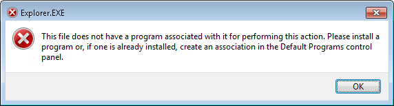

# Does not have a program associated with it

Of all the random alerts that Windows shows, this is one of the most annoying:

> This file does not have a program associated with it for performing this action. Please install a program or, if one is already installed, create an association in the Default Programs control panel.

> This file 

Which file?

> does not have a program associated with it 

> for performing this action. 

*Which* action?

> Please install a program 

Great advice! I will install a program. Which program? For doing what?

> or, if one is already installed,

Many programs are already installed... do I need to uninstall all my programs but one??

> create an association in the Default Programs control panel.

Create an association between what and who!?

