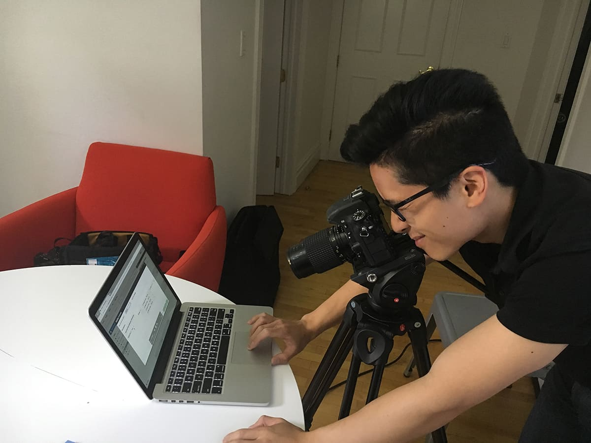

# Need to include the mouse cursor/pointer in a screenshot?

Not like this:

Like this:

Use greenshot "a free screenshot tool optimized for productivity"

## Source
 
 * Image from [How to Make a Killer Explainer Video for Your Brand's Homepage - the Ultimate Guide](https://librisblog.photoshelter.com/how-to-use-video-marketing-brand-website/)

## Links

 * Download http://getgreenshot.org/downloads/
 * Source code https://bitbucket.org/greenshot/greenshot/
