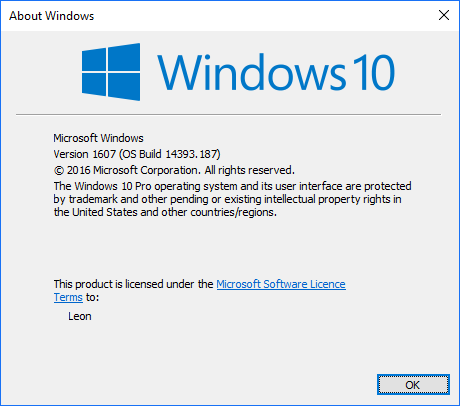

# How can I tell which version of Windows is currently running?

    [Environment]::OSVersion.Version

    
    Major  Minor  Build  Revision
    -----  -----  -----  --------
    10     0      10586  0

Or (for Windows 10 Anniversary edition)

    Major  Minor  Build  Revision
    -----  -----  -----  --------
    10     0      14393  0    
    
or perhaps you see...

    Major  Minor  Build  Revision
    -----  -----  -----  --------
    6      1      7601   65536

And you can turn the major/minor into a well known version name, using the table below...
    
|Operating system|Version number|
|-----|-------|
|Windows 10|10.0*|
|Windows Server 2016|10.0*|
|Windows 8.1|6.3*|
|Windows Server 2012 R2|6.3*|
|Windows 8|6.2|
|Windows Server 2012|6.2|
|Windows 7|6.1|
|Windows Server 2008 R2|6.1|
|Windows Server 2008|6.0|
|Windows Vista|6.0|
|Windows Server 2003 R2|5.2|
|Windows Server 2003|5.2|
|Windows XP 64-Bit Edition|5.2|
|Windows XP|5.1|
|Windows 2000|5.0|

And is windows a 64 or 32 bit version??

    [Environment]::Is64BitOperatingSystem
    True

I suspect that will be true for a long time to come.

Consider also....

    [Environment]::Is64BitProcess
    True

Which is [described here](../powershell/is_this_64_or_32_bit_powershell_today.md)

You can also run `winver.exe` which produces a dialog something like this:

C:\users\leon\dropbox\secretGeek\util\til\windows

