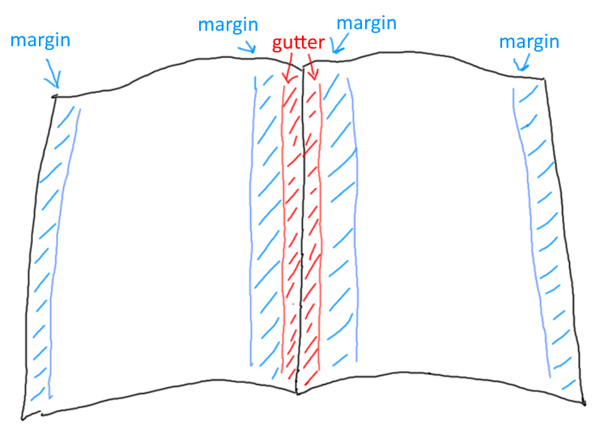
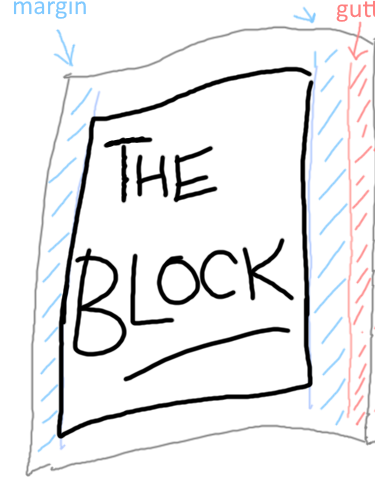
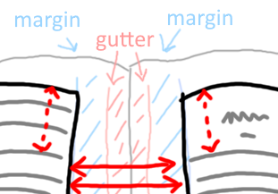
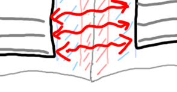

# Amateur Mistakes

To make a self-published book look like an amateur book, you don't have to break *all* these guidelines, any *one* will do.

A book is composed of two files: the interior file (which includes the book itself) and the exterior file (which contains the front cover, spine and back cover)

## Page Layout

* gutter: odd-numbered pages, gutter on left; even-numbered pages, gutter on right.
* margins: the usual thing in an amateur book is to have these *too cramped*. (Similarly for leading in body content, see below)

## Table of Contents (ToC)

 * when writing/revising you may need to refer to a detailed outline of the book that has every possible level of heading (e.g. heading 1-6) but the needs of your reader are not the same as the needs of a writer/editor, in particular:
   * Fiction: usually no TOC
   * Non-Fiction: Ideally a single page, only chapter headings. If it must be more than one page then you have "contents at a glance" and the more detailed contents. Review similar professional books as a grounding device.   
 * Don't use a line of dots to link chapter title and page number (this is the default in word) - increase leading (line-height) instead.
 * If SMALL-CAPS styles are used, ensure it is a font that include a SMALL-CAPS variant and it is not simply a squished-down caps.
 * No header text on the TOC page
 

## Chapters

 * new chapter starts on a new page
 * new chapters begin on the right hand side (i.e. on odd-numbered pages) 
 * first page of chapter does not have a header
 * first page of chapter has consistent spacing from top
 * body text is serif font
 * headings may be sans serif (note the typographic term 'gothic' is a synonym for 'sans serif')
 * consistent style of chapter headings, including capitalization rules, see [Title Case Converter](https://titlecaseconverter.com/)
 * pay attention to kerning of headings
 * orphan lines, orphan words
 * Instead of chapters called "chapter 1" — use Roman numerals and omit the word chapter

## Header

 * first page of each chapter: no header
 * TOC: no header
 * header text: lighter weight than body, or smaller font size

## THE BLOCK

 * The block is the part of the page where the body text goes. It's the page minus the gutter, the margins, the headers and the footers. That's THE BLOCK
 * The block shouldn't move up or down or in or out on each page
 * Now, imagine this. Imagine the page is thin, so thin as to be almost completely translucent. Each line of text will have a line of text behind it. The lines of text on each side of the paper should be on top of each other. And the space between the lines should be completely clear on both sides
 
 
 * Here is the tricky thing about getting "the block" right....
 

 
 * If there is a heading or break part way down a page, this property of alignment between the two sides of the page should still be maintained perfectly. The spaces still align with the spaces. The lines of text still align with the lines of text.
 * THUS, the start of a new chapter may be a few lines down the page, but the distance to the top of the page should be equivalent to a whole number of lines of text.

 * If you get this wrong at the top of the page, you will see it at the bottom of the page....
 

...and you will see it if you hold the page up to the light.

It's a fine detail, but part of avoiding that amateur feel.

 
## Page numbering

 * page numbering starts at 1 when the content itself starts
 * page 1 is on the right hand side. (An odd numbered page of the interior file.)
 * page numbers are listed at the header or foot of the page (not both!)
   * near the corner, aligned with the edge of the "block" of the body text.
   * odd numbers are aligned to the right of the block
   * even numbers are aligned to the left of the block

## Content

 * no spelling errors
 * consistent punctuation -- see [the punctuation guide](https://www.thepunctuationguide.com/)
   * in particular, apostrophes, single-quotes and double-quotes: smart not straight.
   * consistent use of dash, En dash and Em dash.
 * consistent use of terminology
 * ensure typographic characters other than regular English letters are printed correctly. e.g. &eacute; (So many different ways these can fail)
 * fonts for body content should be Serif fonts

> The most widely used typefaces for book body text include Baskerville, Bembo, Garamond, Janson, Palatino, and Times Roman (although this more of a newspaper font). Sans serif fonts may be difficult to read for an entire book.
>
> If using a serif font for body text (Berkeley, Palatino, Garamond, etc.), do not use smaller than 10pt. size
>
> &mdash;[Amit Agarwal: Which Fonts Should You Use for Writing a Book](https://www.labnol.org/internet/blogging/which-fonts-should-you-use-for-writing-a-book/3141/)

 * paragraph style: line-height (leading) is not too cramped and not too spacious. (The standard amateur ploy is to have them too cramped)
 * alignment: justified.
 * font-weight: does your book have more ink on the page than a professional book plucked from your shelf?
 * layout of quotes: consistent, pleasing.
 
 
## Paragraphs

 *  indented first line of paragraph, no line space between paragraphs.

^ Worth mentioning because on the internet we tend to leave a line of space between paragraphs.

 * First line after a heading, or sub heading, is not indented.

## Separators

 * Stylish and consistent. Centered. Most amateur look here would be: three literal asterisks left aligned. 

## Images

 * images at high DPI, e.g. at least 300.
 
Images shown on a Windows PC are traditionally 96 DPI -- dots per inch, and on an Apple Mac, 72 DPI. A newer "high DPI" screen on either system will be a higher DPI than this. Printed material is generally 300 DPI or higher. You need to look a lot closer at a printed page to see how it is put together, compared to a computer monitor.

 
 

## Exterior (cover)

<!-- TODO: picture: interior file, exterior file -->

 * exterior image has spine at correct width (spine-width depends on the number of interior-pages, thickness of paper, etc.); an amateur book might end up with a cover design where the spine is ill-fitted.
 * spine: direction of text is consistent with the majority of books on your shelf, i.e. text flows top to bottom. When looking at the book on the shelf you lower your right ear to your shoulder to read the spines.
 * exterior image, high DPI, all text-crisp.

## External sources

 * [Standard Ebooks: Typography Manual](https://standardebooks.org/contribute/typography)
 * [Michele DeFilippo: Book Layout Basics](https://www.ingramspark.com/blog/book-layout-basics)
 * [Amit Agarwal: Which Fonts Should You Use for Writing a Book](https://www.labnol.org/internet/blogging/which-fonts-should-you-use-for-writing-a-book/3141/)