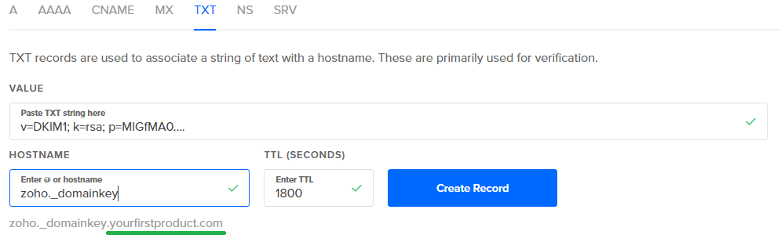
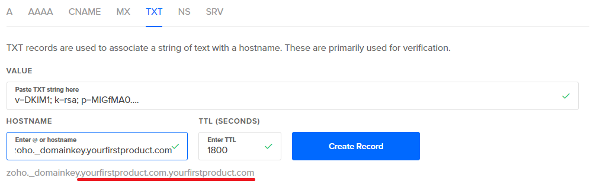

# Register a domain with zoho (aka DNS Text records at digitalocean such as DKIM)

I signed up to Zoho, following this guide:

[How To Set Up Zoho Mail with a Custom Domain Managed by DigitalOcean DNS](https://www.digitalocean.com/community/tutorials/how-to-set-up-zoho-mail-with-a-custom-domain-managed-by-digitalocean-dns)

## Verify upon sign up

You need to verify with a phone number. (They don't want people using their systems to send spam. Good for them!)

You can host 1 domain you own, and 25 email addresses for free. That's very generous.

## Verify domain

To verify that I own the domain I went with the html technique. At your website you create a folder called zohoverify and put a file they give you, verifyforzoho.html which contains a big number.

## DNS Records

There were a lot of DNS records to configure.

### MX Records

Two MX records. Each with a different priority.

It says 

> You must remove (delete) any other MX records other than the above 2 records. In case you have previous providers MX records, then you may not receive emails in Zoho.

So for NimbleText.com where previously the email was managed by Arvixe, I will have to delete the old MX records. Hmmm, bit reluctant. For now I edited the old ones to have lower priority (30 and 40) than the new ones. That could turn out to be a ridiculous idea.

### TXT Records: SPF

Configuring SPF is easy -- but you also have to get Zoho to confirm it. And you can't confirm it from the wizard. Maybe because it takes times to propagate I don't know.

After you've finished the setup wizard you need to go to the control panel: <https://mailadmin.zoho.com/cpanel/index.do#spf>

	Control Panel > Mail Administration > Email authentication > SPF

And click verify.

### TXT Records: DKIM

For DKIM you click into a configure DKIM screen. It's not covered at all in the tutorial I was following.

You have to pick your domain, then click "Add selector"

You now have to "choose" a selector. I'm not sure why it's up to you. Just type in "zoho". Hit save, and now it will give you a TXT name and value.

For example;

	TXT - Host/Name
	zoho._domainkey.nimbletext.com

	TXT Value	
	v=DKIM1; k=rsa; p=nwjcnevnevnckjNskjdnckJNA...(snip)...cjsnkNEWJWEKJNCkewmckwenc
	
	
Main thing I want to show is that when adding a TXT record to DNS at Digital Ocean (such as the DKIM text record) you don't need to include the domain name, because digital ocean automatically adds it for you.

(And it doesn't matter if you do or don't include the trailing dot -- digital ocean does that for you automatically) 

Hopefully this picture can demonstrate what I'm talking about:

If you do put in the domain, it goes bad... look at this stinking hot mess:

Of course, I never made that mistake and wasted half my damn night. I'm just showing this in case someone else is less clever than me.

When doing this same DKIM configuration at Arvixe, I pasted in the whole TXT Host/Name, e.g. zoho._domainkey.nimbletext.com

...and then when I saved it, it was displayed as: "zoho._domainkey" which seemed promising when considered alongside their other TXT records on display: they never show the domain in the value of the DNS records, nor do they show "@". They just show no value in places where you'd expect to see the domain.

I clicked "verify" (over in zoho) and it verified successfully.

...so they have done the opposite of digitalocean. 

After finishing with the DKIM bit, hit "Return to Domain setup" and continue.

